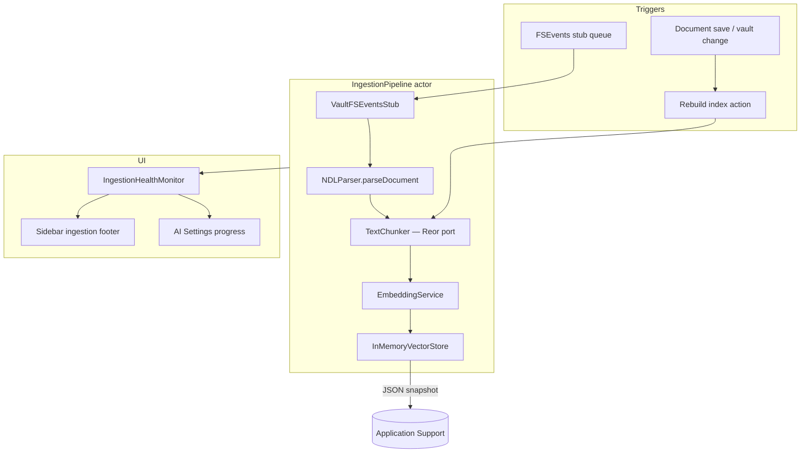

# AI Ingestion Pipeline

**Last updated:** 2026-05-18  
**Related:** [AI-Pipeline.md](./AI-Pipeline.md) · [adr/0003-reor-rag-in-swift.md](../adr/0003-reor-rag-in-swift.md) · `OpenWrite/AI/ReorPortNotes.md`

OpenWrite ingests note content into a **local vector index** for hybrid retrieval and RAG. Ingestion is user-visible, cancellable, and runs entirely on-device (embeddings default to LM Studio with a hash fallback).

---

## End-to-end flow

---

## Components

| Component | File | Role |
|-----------|------|------|
| `IngestionPipeline` | `Core/Indexing/IngestionPipeline.swift` | Orchestrates stages; cooperative cancel |
| `VaultFSEventsStub` | `Core/Indexing/VaultFSEventsStub.swift` | Queues changed paths until real FSEventStream (E-04) |
| `IngestionHealth` / `IngestionHealthMonitor` | `Core/Indexing/IngestionHealth.swift` | Status enum, progress, persisted `lastError` |
| `IndexerService` | `Core/Indexing/IndexerService.swift` | `PipelineIndexerService` → pipeline; `cancel()` |
| `InMemoryVectorStore` | `Core/Indexing/InMemoryVectorStore.swift` | Cosine search + JSON persistence stub |
| `OpenWriteAIServices` | `AI/OpenWriteAIServices.swift` | Wires pipeline, reindex, cancel, disk bootstrap |
| `TextChunker` | `Core/Indexing/IndexChunk.swift` | Heading-bounded chunks (AGPL — Reor `chunking.ts`) |
| `RetrievalQueryAnalysis` | `Core/Retrieval/RetrievalQueryAnalysis.swift` | Local query expansion, temporal detection, diversity cap |

### Chunk shape (index v3)

Each embedded chunk includes:

1. **Title-lead chunk** — page title, filename, first-paragraph preview, wikilink names (high recall for “find this note”).
2. **Section chunks** — `Page: Title · Updated …` header, optional `Section: H1 > H2` breadcrumb, body text.
3. **Metadata on disk** — `headingPath`, `documentUpdatedAt`, `isTitleLeadChunk` (JSON format version `3`).

Code blocks are omitted from embed text. Cross-section **150-character** overlap bridges adjacent heading groups; recursive splits use the same overlap budget.

### Retrieval (post-ingest)

`HybridRetrievalService` ranks a larger candidate pool (`rerankCandidateCount`), then:

- **Title / filename keyword boost** on top of body matches
- **Recency boost** when the query is temporal (“yesterday”, “latest”, …)
- **Per-document cap** (max 2 chunks per note in top-k)

Probe locally: `./scripts/openwrite-cli.sh test-queries --reindex`

---

## Ingestion statuses

| `IngestionStatus` | Meaning |
|-------------------|---------|
| `idle` | No work in flight |
| `watching` | FSEvents stub armed (import folders) |
| `parsing` | Reading / parsing NDL source |
| `chunking` | `TextChunker` producing `IndexChunk`s |
| `embedding` | `EmbeddingService.embed` per chunk |
| `storing` | `InMemoryVectorStore.upsert` |
| `rebuilding` | Full vault rebuild |
| `cancelled` | User or task cancellation |
| `failed` | Error recorded in `lastError` |

Progress fields: `documentsCompleted` / `documentsTotal`, `chunksCompleted` / `chunksTotal`, surfaced in the sidebar footer and Settings.

---

## Persistence (MVP)

Vectors and chunk metadata serialize to:

`~/Library/Application Support/openwrite/index.json`

Format version `3` (legacy `OpenWrite/vector_index.json` v1–2 still load; reindex to pick up title-lead chunks and section breadcrumbs). On launch, `OpenWriteAIServices` loads the snapshot if present; a corrupt file is ignored and the vault can be reindexed.

Future: LanceDB / SQLite FTS parity with Reor `vector-database` layout — see [ReorPortNotes.md](../../OpenWrite/OpenWrite/AI/ReorPortNotes.md).

---

## Cancellation

- Settings **Cancel indexing** → `OpenWriteAIServices.cancelIndexing()`
- `IngestionPipeline.cancel()` sets a flag checked between chunks and documents
- Swift `Task` cancellation on the wrapping `indexingTask` propagates via `Task.checkCancellation()`

---

## FSEvents stub (E-04)

`VaultFSEventsStub` does not open a live `FSEventStream` yet. Importers or tests call `simulatedEvent(at:)` / `enqueueChanged(path:)`; `processPendingFilesystemEvents()` drains the queue through `ingestNDLFile(at:)`.

---

## License notes

| Source | License | OpenWrite files |
|--------|---------|-----------------|
| Reor chunking / vector patterns | AGPL-3.0 | `IndexChunk.swift`, `IngestionPipeline.swift`, `InMemoryVectorStore.swift` |
| rem ingestion health UX | MIT (inspired) | `IngestionHealth.swift`, `VaultFSEventsStub.swift` |

---

## Testing checklist

| Case | Expected |
|------|----------|
| Rebuild index | Progress in sidebar; chunk count updates |
| Cancel mid-rebuild | Status `cancelled`; partial index retained |
| Relaunch app | JSON reload restores chunk count |
| LM Studio down | Hash embedding fallback still indexes |
| Import NDL path | Stub queue → parse → index |
