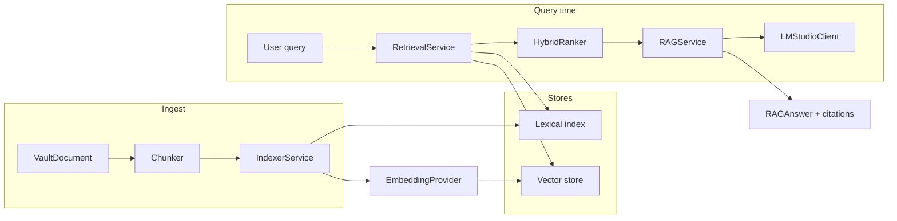

# AI Pipeline

**Last updated:** 2026-05-17  
**Related:** [Overview.md](./Overview.md) · [DataModel.md](./DataModel.md) · [adr/0003-reor-rag-in-swift.md](../adr/0003-reor-rag-in-swift.md) · [OpenWriteMasterPlan.md § AI / LM Studio](../OpenWriteMasterPlan.md#ai--lm-studio)

OpenWrite’s AI stack implements a **dual-generator** model: the human author produces durable notes; a local language model **retrieves, ranks, and composes** answers from that corpus when invoked. No default cloud model; no background exfiltration of the full vault.

This document describes the end-to-end pipeline: **indexing → chunking → embedding → retrieval → RAG → citations**.

---

## Pipeline overview



---

## Design principles

| Principle | Implementation |
|-----------|----------------|
| User-triggered | Index rebuild and chat run on explicit actions or save hooks—not silent full-vault upload |
| Local endpoint | Default `http://127.0.0.1:1234` (LM Studio) |
| Citations required | `RAGAnswer.citations` maps to `RetrievalHit` with `documentID` + optional `blockID` |
| Clean-room | Reor **behavior** only; Swift implementation, no AGPL runtime |
| Fail closed | Health check before chat; empty retrieval → honest “no context” message |

---

## Phase status

| Component | File | Phase 1 | Target (E-03 / E-05) |
|-----------|------|---------|----------------------|
| Config | `LMStudioConfig.swift` | Done | Persist in user settings |
| Health | `LMStudioClient.healthCheck()` | Done | Retry/backoff UI |
| Chat | `LMStudioClient` | Not implemented | Streaming `POST /v1/chat/completions` |
| Embeddings | `EmbeddingProvider` | Planned | `POST /v1/embeddings` |
| Indexer | `IndexerService` | No-op stub | FSEvents + background queue |
| Retrieval | `RetrievalService` | No-op stub | Hybrid lexical + vector |
| Ranker | `HybridRanker` | Sort by score stub | Weighted fusion |
| RAG | `RAGService` | Placeholder (empty text) | Full prompt + stream |

---

## Stage 1: Indexing triggers

| Trigger | Behavior |
|---------|----------|
| Document save | `IndexerService.index(documentID:blocks:)` |
| Document delete | `IndexerService.remove(documentID:)` |
| Vault open / rebuild | `rebuildAll(documents:)` |
| FSEvents (E-04) | External `.md` import folder watch (optional) |

Indexer runs **off the main actor**; UI shows progress in status area (design: honest progress, not fake cloud spinners).

---

## Stage 2: Chunking

**Goal:** Produce retrieval units small enough for embedding context windows, large enough to carry meaning.

### Heading-aware chunking (target)

1. Walk `rootBlocks` depth-first.
2. Maintain `headingPath: [String]` — update on `heading1`–`heading3`.
3. Accumulate text into current chunk until:
   - Next heading at same or higher level, or
   - Character/token budget exceeded (configurable, e.g. 512–1024 tokens equivalent).
4. Emit `Chunk` with `documentId`, optional `blockId` (first block in chunk), `plainText`, `headingPath`.

### Block-level metadata

- **Wikilinks:** index target title for lexical search.
- **Code blocks:** optional separate chunk or excluded from embed (product decision: exclude by default to reduce noise).
- **Properties:** include `title`, `tags`, `summary` in document-level header chunk.

### Reor alignment (conceptual)

Reor chunks markdown by headings in `chunking.ts`. OpenWrite ports the **algorithm shape** in Swift against `NoteBlock` trees—not the TypeScript implementation.

---

## Stage 3: Embedding

### `EmbeddingProvider` (planned protocol)

```swift
protocol EmbeddingProvider: Sendable {
    func embed(texts: [String]) async throws -> [[Float]]
}
```

### LM Studio

- Endpoint: `{baseURL}/v1/embeddings`
- Model: same or dedicated embedding model in `LMStudioConfig`
- Batch texts per document save to reduce HTTP overhead

### Storage

- Vectors stored alongside chunk id in `index/vectors/`
- Dimensionality fixed per model; re-embed entire vault on model change (see [NDL/Migration.md](../NDL/Migration.md) index section)

---

## Stage 4: Lexical index

Parallel **keyword** path for hybrid search:

- SQLite FTS5 or inverted index over `plainText`
- Query: tokenize user string, BM25-style scoring
- Produces `RetrievalHit` with `score_lexical`

Benefits: exact match on names, IDs, rare tokens; complements semantic drift.

---

## Stage 5: Retrieval

### `RetrievalService`

```swift
protocol RetrievalService: Sendable {
    func search(query: String, limit: Int) async throws -> [RetrievalHit]
}
```

### `RetrievalHit`

| Field | Purpose |
|-------|---------|
| `id` | Hit id (may equal chunk id) |
| `documentID` | Source note |
| `blockID` | Optional anchor for UI scroll |
| `score` | Combined or interim score |
| `snippet` | Short preview for UI and prompt |

### Hybrid fusion (`HybridRanker`)

```
score = lexicalWeight * score_lexical + vectorWeight * score_vector
```

Default weights: `0.5` / `0.5` (tunable; REM-inspired semantic + keyword fallback).

Normalize scores per query before merge; take top-k (e.g. k=8 for prompt, k=20 for related-notes sidebar).

---

## Stage 6: RAG (retrieval-augmented generation)

### `RAGService`

```swift
protocol RAGService: Sendable {
    func answer(query: String, limit: Int) async throws -> RAGAnswer
}
```

### `PlaceholderRAGService` (current)

1. `retrieval.search(query:limit:)`
2. `client.healthCheck()`
3. Returns `RAGAnswer(text: "", citations: hits)` — wiring stub

### Target prompt structure

```
System: You answer using ONLY the provided note excerpts. Cite block ids as [block:UUID].
User context:
---
[doc:UUID block:UUID] snippet...
---
Question: {query}
```

### `RAGAnswer`

| Field | Description |
|-------|-------------|
| `text` | Model completion (streamed to UI in v1) |
| `citations` | Subset of hits actually used (may match retrieval hits) |

### Streaming

- `URLSession` bytes delegate or async sequence from LM Studio SSE
- UI: `ChatPanel` appends tokens; cancel on window close

### Error handling

| Condition | UX |
|-----------|-----|
| LM Studio down | Inspector banner + link to settings |
| Empty retrieval | “No notes matched; try rephrasing or broaden query.” |
| Timeout | Respect `LMStudioConfig.timeoutSeconds` |

---

## Stage 7: Related notes (sidebar)

Same retrieval path, different presentation:

- Trigger: document focus or selection
- Query: embedding of current note title + lead paragraphs, or precomputed doc centroid
- `limit`: 5–10 neighbors
- UI: `RelatedNotesPanel` — no full chat completion required

---

## LM Studio integration

### Configuration (`LMStudioConfig`)

| Field | Default | Notes |
|-------|---------|-------|
| `baseURL` | `http://127.0.0.1:1234` | User override |
| `model` | `local-model` | Chat model id |
| `apiKey` | `nil` | Optional Bearer token |
| `timeoutSeconds` | `60` | Health uses `min(10, timeout)` |

### URLs

- Models: `{baseURL}/v1/models`
- Chat: `{baseURL}/v1/chat/completions`
- Embeddings: `{baseURL}/v1/embeddings`

### Health check (implemented)

`LMStudioClient.healthCheck()` → `GET /v1/models`, success on 2xx.

Used by ContentView button and as RAG precondition.

---

## Privacy and logging

| Data | Leaves Mac? |
|------|-------------|
| Vault `.owdoc` | No (local disk) |
| Chunks in prompt | Only to user-configured host (default localhost) |
| Telemetry | None in MVP |

Debug builds: redact prompt text in logs; ship without verbose LLM logging in release.

---

## Agent tools (v2 — non-goals for v1)

Reor-shaped agent config may add tools:

- `search_vault(query)`
- `create_note(title, blocks)` with user confirm

Requires `AgentConfig.swift` and strict confirmation UI—see master plan v2.

---

## Testing

| Test | Method |
|------|--------|
| Retrieval fusion | Fixture chunks + known query → expected order |
| RAG prompt | Snapshot prompt string with frozen hits |
| LM Studio | `URLProtocol` mock returning OpenAI JSON |
| Indexer idempotency | Save same doc twice → single chunk set |

---

## Epic mapping

| Epic | Pipeline stages |
|------|-----------------|
| E-04 FSEvents indexer | Triggers, chunker, lexical |
| E-03 LM Studio RAG | Embeddings, RAG, related panel, chat |
| E-05 Hybrid search | Retrieval + HybridRanker tuning |

Details: [RoadmapEpics.md](../RoadmapEpics.md).

---

## Related documents

- [DataModel.md § Index metadata](./DataModel.md#index-metadata-v1-target)
- [Glossary.md § Dual-generator](../Glossary.md)
- [adr/0003-reor-rag-in-swift.md](../adr/0003-reor-rag-in-swift.md)
- [OpenWriteMasterPlan.md § Reor](../OpenWriteMasterPlan.md#reor-foundation--agpl-clean-room-swift)
