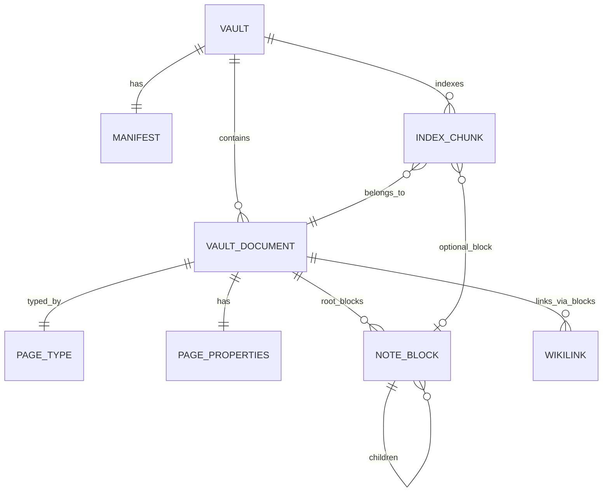

# Data Model

**Last updated:** 2026-05-17  
**Related:** [Overview.md](./Overview.md) · [NDL/Specification.md](../NDL/Specification.md) · [OpenWriteMasterPlan.md § Vault bundle](../OpenWriteMasterPlan.md#vault-bundle-v0)

This document specifies OpenWrite’s **persistent and in-memory data structures**: the vault bundle, encrypted documents, typed pages, property schema, graph index, and search index metadata.

---

## Entity relationship (logical)



---

## Vault bundle (`.openwrite`)

A vault is a **package directory** (or macOS bundle) owned by the user. It is the unit of backup, copy, and lock.

### Layout (v0 → v1)

```
MyVault.openwrite/
├── manifest.json              # Plaintext metadata (no keys)
├── documents/
│   ├── {document-uuid}.owdoc  # AEAD-encrypted payload per note
│   └── ...
└── index/                     # v1: encrypted or plaintext index metadata
    ├── lexical/               # Keyword / FTS store (implementation TBD)
    ├── vectors/               # Embedding ids + dimensions
    └── graph/                 # Serialized backlink adjacency (optional duplicate of in-memory)
```

### `manifest.json` (plaintext)

| Field | Type | Description |
|-------|------|-------------|
| `version` | `Int` | Bundle format version (start at `1`) |
| `vaultId` | `UUID` | Stable vault identifier |
| `createdAt` | ISO8601 | Vault creation time |
| `documentIds` | `[UUID]` | Registry of document files |
| `crypto` | object | Algorithm id, KDF params, salt (no derived keys) |
| `pageTypeRegistry` | object | Built-in + custom type ids (optional v1) |

**Never store** passphrase, derived data keys, or LM Studio API keys in `manifest.json`.

Example (illustrative):

```json
{
  "version": 1,
  "vaultId": "7c9e6679-7425-40de-944b-e07fc1f90ae7",
  "createdAt": "2026-05-17T12:00:00.000Z",
  "documentIds": ["550e8400-e29b-41d4-a716-446655440000"],
  "crypto": {
    "algorithm": "chacha20-poly1305",
    "kdf": "pbkdf2-hmac-sha256",
    "iterations": 600000,
    "salt": "base64..."
  }
}
```

---

## Document envelope (`.owdoc`)

Each note is one file: `documents/{uuid}.owdoc`.

### Encryption (target v1 — E-01)

1. Serialize `VaultDocument` to JSON (UTF-8).
2. **Associated data (AAD):** document UUID string (prevents swapping ciphertext between files).
3. `EncryptionService.seal(plaintext, associatedData:)` → ciphertext written atomically.

`VaultStore.sealedPayload(for:)` in Phase 1 already follows this contract with `NoOpEncryptionService`.

### Plaintext JSON schema (`VaultDocument`)

| Field | Swift type | Description |
|-------|------------|-------------|
| `id` | `UUID` | Stable document id (matches filename) |
| `title` | `String` | Fallback title when property title empty |
| `pageType` | `PageType` | Typed page kind |
| `properties` | `PageProperties` | Structured metadata |
| `rootBlocks` | `[NoteBlock]` | NDL block forest |
| `createdAt` | `Date` | Creation timestamp |
| `updatedAt` | `Date` | Last mutation |
| `metadata` | `[String: String]` | Extension bag (import source, template id, …) |

**Computed:**

- `displayTitle` — `properties[.title]` if non-empty, else `title`.

**Operations:**

- `touchUpdatedAt()` — bump `updatedAt` on edit.
- `applyTemplate(_:preserveTitle:)` — replace type, properties, blocks from `TypeTemplate`.

---

## Typed pages

OpenWrite uses **lightweight object types** (Anytype-inspired concept, independent schema) without cloud sync or relation graphs in v1.

### `PageType`

| Case | Display | Typical use |
|------|---------|-------------|
| `note` | Note | General writing |
| `task` | Task | Action items, checklists |
| `reference` | Reference | Books, papers, URLs |
| `journal` | Journal | Daily log |
| `project` | Project | Multi-milestone work |

`PageTypeRegistry` (Codable) holds built-in cases and future `customTypeIDs`.

### Property schema per type

`PageProperties.schema(for:)` returns applicable `PagePropertyKey` values:

| Page type | Keys |
|-----------|------|
| `note` | title, tags, summary |
| `task` | title, status, dueDate, priority, assignee, tags |
| `reference` | title, url, author, publishedAt, rating, tags, summary |
| `journal` | title, mood, location, tags, startedAt |
| `project` | title, status, dueDate, priority, assignee, startedAt, completedAt, tags, summary |

### `PagePropertyValue`

| Variant | Use |
|---------|-----|
| `.text(String)` | Default string fields |
| `.date(Date)` | dueDate, startedAt, … |
| `.tags([String])` | Comma-separated in NDL |
| `.rating(Int)` | 1–5 stars |
| `.url(URL)` | Reference links |

Parsing from NDL payloads: `PagePropertyValue(ndlPayload:for:)`.

### Enumerations (pickers)

- `TaskStatus` — todo, in_progress, done, blocked, cancelled
- `ProjectStatus` — planning, active, on_hold, completed, archived
- `Priority` — low, medium, high, urgent

### `TypeTemplate`

Factory for new documents: `TypeTemplate.template(for:title:)` returns suggested title, default `PageProperties`, and starter `rootBlocks` per type.

---

## Note block tree (`NoteBlock`)

Canonical content unit. See [NDL/Specification.md](../NDL/Specification.md) for line syntax.

| Field | Type | Description |
|-------|------|-------------|
| `id` | `UUID` | Stable block identity (citations, blockref) |
| `kind` | `Kind` | Block type enum |
| `text` | `String` | Primary payload (line body, code, link inner) |
| `children` | `[NoteBlock]` | Indented subtree (v0: one level typical) |
| `attributes` | `[String: String]` | `language`, `checked`, `key`/`value` for properties |

### Kinds (implemented in code today)

| Kind | NDL | Notes |
|------|-----|-------|
| `paragraph` | plain line | Default |
| `heading1`–`heading3` | `#` … `###` | |
| `bullet` | `- ` | Outliner row |
| `quote` | `> ` | |
| `code` | fenced ``` | `attributes["language"]` |
| `divider` | `---` | |
| `wikilink` | `[[…]]` | Target title ± uuid |
| `property` | `@key value` | Typed page fields in body |

**Planned kinds** (master plan, not all in parser yet): `numbered`, `todo`, `blockref`, `callout`.

### Plain text for indexing

Indexer extracts searchable text by walking the tree:

- Include `text` for all kinds except `divider`
- Resolve `wikilink` to title string
- Flatten `property` to `key: value`
- Recurse `children` with optional heading context (chunker v1)

---

## NDL serialization inside documents

Two representations coexist:

1. **Canonical:** `rootBlocks: [NoteBlock]` in `VaultDocument` JSON.
2. **Linear NDL:** `NDLSerializer.serialize(document:)` for display/export — merges property blocks + body.

Property lines serialize as `@key value` (see `NoteBlock.propertyBlock`).

---

## Graph model

### Wikilinks

- Block kind `.wikilink` with `text` formatted as `title` or `title|uuid`.
- `BacklinkIndex` maps `targetDocumentID → Set<sourceDocumentID>`.
- Rebuilt on save or via incremental `registerLink(from:to:)`.

### Block references (planned)

- Syntax: `((uuid))` → kind `.blockref`
- Transclusion and backlink-to-block in v0.1+

### Graph view (UI)

Read-only force-directed or hierarchical layout over documents as nodes, links as edges — no edit in graph v1.

---

## Index metadata (v1 target)

Separate from `.owdoc` content; lives under `index/` or embedded DB file.

### Chunk record (conceptual)

| Field | Description |
|-------|-------------|
| `chunkId` | UUID |
| `documentId` | Parent note |
| `blockId` | Optional anchor block |
| `headingPath` | e.g. `["H1 Title", "H2 Section"]` |
| `plainText` | Chunk body for BM25 + embed |
| `embedding` | `[Float]` or external id |
| `updatedAt` | For invalidation |

Chunking policy (Reor-inspired): split on headings; max token/char budget per chunk; overlap optional in v1.1.

### Lexical index

- SQLite FTS5 or GRDB-backed inverted index
- Updated by `IndexerService.index(documentID:blocks:)`

### Vector index

- Store embeddings from LM Studio `/v1/embeddings`
- Cosine similarity at query time; combined with lexical via `HybridRanker`

### Invalidation

| Event | Action |
|-------|--------|
| Document save | Re-index document; remove stale chunks |
| Document delete | `IndexerService.remove(documentID:)` |
| Vault rebuild | `rebuildAll(documents:)` |

Phase 1: `NoOpIndexerService` performs no persistence.

---

## In-memory store (`VaultStore`)

| Property | Type | Role |
|----------|------|------|
| `documents` | `[VaultDocument]` | Loaded corpus |
| `selectedDocumentID` | `UUID?` | UI selection |
| `encryption` | `EncryptionService` | Seal/open helper |

**Phase 1:** Single in-memory sample (`welcomeSample`); no bundle path on disk yet.

---

## Import / export interchange

| Direction | Format | Notes |
|-----------|--------|-------|
| Import | Markdown folder | `MarkdownImporter` → `NDLParser` (lossy for advanced blocks) |
| Export | Markdown | Generated from `NDLSerializer` (v1) |
| Export | Plain text | Strip markup |
| Publish | Thread / newsletter templates | v2 stub E-10 |

Markdown is **not** round-trip canonical for typed properties unless front matter mapping is defined (v1.1).

---

## Versioning

| Artifact | Version field | Doc |
|----------|---------------|-----|
| Vault bundle | `manifest.version` | [NDL/Migration.md](../NDL/Migration.md) |
| NDL grammar | `ndl` comment or manifest flag | [NDL/Migration.md](../NDL/Migration.md) |
| Index store | `index/version.json` | TBD |

---

## Codable & migration notes

- All model types are `Codable` for JSON inside `.owdoc`.
- **Additive** schema changes: new optional fields default on decode.
- **Breaking** changes: bump `manifest.version`, run migration tool, document in [NDL/Migration.md](../NDL/Migration.md).

---

## Code references

```swift
// VaultDocument — document root
struct VaultDocument: Identifiable, Codable {
    var id: UUID
    var title: String
    var pageType: PageType
    var properties: PageProperties
    var rootBlocks: [NoteBlock]
    var createdAt: Date
    var updatedAt: Date
    var metadata: [String: String]
}
```

```swift
// NoteBlock — tree node
struct NoteBlock: Identifiable, Codable {
    var id: UUID
    var kind: Kind
    var text: String
    var children: [NoteBlock]
    var attributes: [String: String]
}
```

```swift
// Encryption contract
protocol EncryptionService: Sendable {
    func seal(_ plaintext: Data, associatedData: Data?) throws -> Data
    func open(_ ciphertext: Data, associatedData: Data?) throws -> Data
}
```

---

## Related documents

- [Overview.md](./Overview.md)
- [AI-Pipeline.md](./AI-Pipeline.md)
- [NDL/Specification.md](../NDL/Specification.md)
- [adr/0002-typed-pages-object-model.md](../adr/0002-typed-pages-object-model.md)
- [RoadmapEpics.md § E-01](../RoadmapEpics.md#e-01-vault-encryption-v1)
