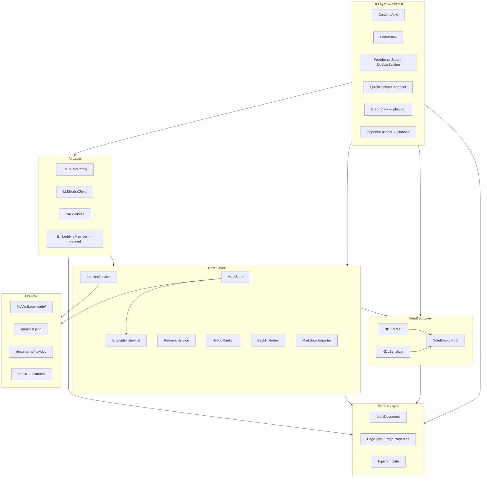
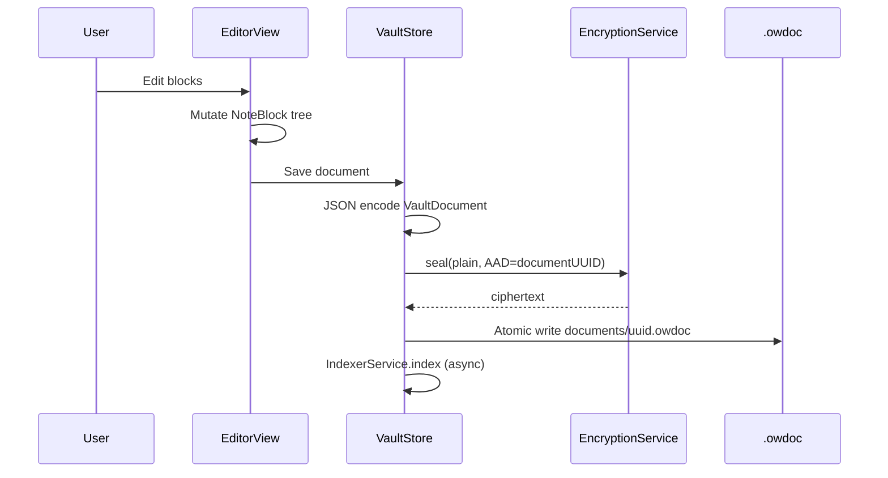
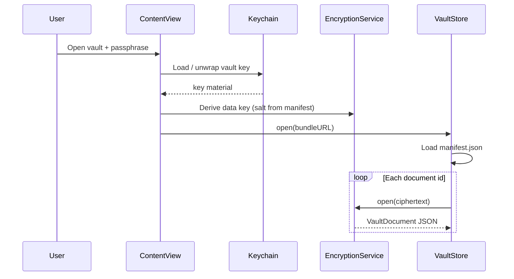
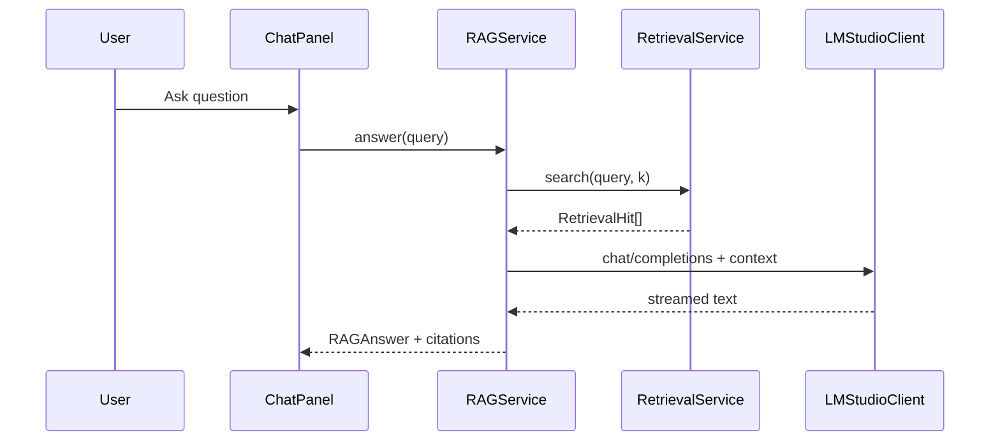

# Architecture Overview

**Last updated:** 2026-05-17  
**Related:** [DataModel.md](./DataModel.md) · [AI-Pipeline.md](./AI-Pipeline.md) · [OpenWriteMasterPlan.md](../OpenWriteMasterPlan.md) · [NDL/Specification.md](../NDL/Specification.md)

This document describes OpenWrite’s **target architecture** and the **current Phase 1 scaffold** under `OpenWrite/OpenWrite/`. For product vision and competitor context, see the [master plan](../OpenWriteMasterPlan.md)—not duplicated here.

---

## Design goals

1. **Local-first** — On-disk vault is source of truth; no mandatory cloud.
2. **Layered dependencies** — UI may call Core and AI; Core must not import UI or AI.
3. **Designed language** — NDL block tree in memory; Markdown is import/export only.
4. **Privacy by default** — Encrypt `.owdoc` bodies; Keychain for key material (v1).
5. **Dual-generator AI** — Human writes; LM Studio retrieves and answers with citations.

---

## Layer diagram



### Layer responsibilities

| Layer | Responsibility | Must not |
|-------|----------------|----------|
| **UI** | Workbench shell, editor, capture, graph, AI inspector | Own persistence format; call network except via AI layer |
| **NoteDSL** | Parse/serialize NDL; block tree invariants | Know about encryption or LM Studio |
| **Models** | `VaultDocument`, typed pages, property schema | Render SwiftUI |
| **Core** | Vault I/O, crypto, index, retrieval, backlinks, import | Import SwiftUI or AI UI |
| **AI** | LM Studio HTTP, embeddings, RAG orchestration | Import UI |
| **On-disk** | `.openwrite` bundle layout | — |

---

## Module map (Swift tree)

All shipping sources live under `OpenWrite/OpenWrite/`. Status reflects the repository as of Phase 1 / early Phase 2 scaffolding.

### App

| File | Status | Role |
|------|--------|------|
| `App/OpenWriteApp.swift` | **Implemented** | `@main`; creates `VaultStore`; injects into `ContentView` |

### UI

| File | Status | Role |
|------|--------|------|
| `UI/ContentView.swift` | **Implemented** | Vault browser shell; document list; LM Studio health check entry |
| `UI/EditorView.swift` | **Implemented** | Note editor (evolving toward block-oriented NDL UI) |
| `UI/Workbench/WorkbenchState.swift` | **Stub** | Selected sidebar section, visibility |
| `UI/Workbench/SidebarSection.swift` | **Stub** | Sidebar enum (notes, inbox, graph, etc.) |
| `UI/Capture/QuickCaptureController.swift` | **Stub** | Fast capture / inbox (E-09) |
| `UI/Graph/GraphView.swift` | *Planned* | Read-only backlink graph (E-06) |
| `UI/Inspector/RelatedNotesPanel.swift` | *Planned* | Semantic sidebar (E-03) |
| `UI/Inspector/ChatPanel.swift` | *Planned* | Streaming Q&A with citations (E-03) |

### Models

| File | Status | Role |
|------|--------|------|
| `Models/VaultDocument.swift` | **Implemented** | Document root: id, title, `pageType`, `properties`, `rootBlocks`, timestamps |
| `Models/PageType.swift` | **Implemented** | Typed pages: note, task, reference, journal, project |
| `Models/PageProperties.swift` | **Implemented** | Typed property bag + per-type schema |
| `Models/TypeTemplate.swift` | **Implemented** | Starter layouts per `PageType` |

### NoteDSL

| File | Status | Role |
|------|--------|------|
| `NoteDSL/NoteBlock.swift` | **Implemented** | AST: `id`, `kind`, `text`, `children`, `attributes`; `NDLSerializer` |
| `NoteDSL/NDLParser.swift` | **Partial** | Line-oriented v0 parser (headings, bullets, quotes, wikilinks, dividers) |
| `NoteDSL/NDLValidator.swift` | *Planned* | Tree invariants, max depth, orphan detection |

### Core — Vault & Crypto

| File | Status | Role |
|------|--------|------|
| `Core/Vault/VaultStore.swift` | **Partial** | In-memory documents; `sealedPayload` encode path |
| `Core/Vault/VaultBundle.swift` | *Planned* | `.openwrite` manifest, atomic directory writes |
| `Core/Vault/VaultUnlock.swift` | *Planned* | Keychain passphrase / device key |
| `Core/Crypto/EncryptionService.swift` | **Stub** | Protocol + `NoOpEncryptionService` → CryptoKit AEAD (E-01) |

### Core — Index & Retrieval

| File | Status | Role |
|------|--------|------|
| `Core/Indexing/IndexerService.swift` | **Stub** | `index` / `remove` / `rebuildAll` protocol; `NoOpIndexerService` |
| `Core/Retrieval/RetrievalService.swift` | **Stub** | Hybrid search orchestration; `RetrievalHit` |
| `Core/Retrieval/HybridRanker.swift` | **Stub** | Lexical + vector score fusion |
| `Core/Graph/BacklinkIndex.swift` | **Stub** | Incoming wikilink map |

### Core — Import

| File | Status | Role |
|------|--------|------|
| `Import/MarkdownImporter.swift` | **Stub** | Markdown → `NDLParser.parse` |

### AI

| File | Status | Role |
|------|--------|------|
| `AI/LMStudioConfig.swift` | **Implemented** | Base URL, model id, timeout, optional API key |
| `AI/LMStudioClient.swift` | **Partial** | `GET /v1/models` health check |
| `AI/RAGService.swift` | **Stub** | `PlaceholderRAGService`: retrieve + health, empty answer text |
| `AI/EmbeddingProvider.swift` | *Planned* | `POST /v1/embeddings` |
| `AI/AgentConfig.swift` | *Planned* | Tool templates (v2) |

### Design (when added to target)

| File | Status | Role |
|------|--------|------|
| `Design/DesignTokens.swift` | *Planned* | Semantic colors, spacing (see `docs/design/`) |

---

## Dependency rules

```
UI → NoteDSL, Models, Core, AI
NoteDSL → (Foundation only)
Models → NoteDSL
Core → Models, NoteDSL
AI → Core, Models
```

**Forbidden:**

- `Core` importing `AI` or `SwiftUI`
- `NoteDSL` importing `VaultStore` or `LMStudioClient`
- Circular references between `VaultStore` and `IndexerService` (indexer receives document snapshots via explicit calls)

---

## Runtime data flows

### Edit path (target v1)



**Phase 1 today:** Documents live in memory; `sealedPayload` uses `NoOpEncryptionService` (pass-through). Disk bundle I/O is planned in E-01.

### Unlock path (target v1)



### AI / RAG path (target v1)

See [AI-Pipeline.md](./AI-Pipeline.md) for the full indexing → embed → retrieve → generate flow.



---

## Workbench information architecture

Inspired by AFFiNE workbench patterns (clean-room Swift only):

| Region | Responsibility |
|--------|----------------|
| **Sidebar** | Vault sections: All notes, Inbox, Journal, Types, Graph (read-only v1) |
| **Document list** | Filtered list by section / search |
| **Editor (center)** | NDL block editor — hero surface |
| **Inspector (trailing)** | Properties for typed page, related notes, AI chat |

`WorkbenchState` holds `selectedSection` and chrome visibility; full tab model is E-08.

---

## Concurrency model

| Component | Actor / isolation |
|-----------|-------------------|
| `VaultStore` | `@MainActor` — UI-bound document list |
| `EncryptionService` | `Sendable` protocol — crypto work can move off main actor in v1 |
| `IndexerService`, `RetrievalService`, `RAGService` | `Sendable` — async indexing/search off UI thread |
| `LMStudioClient` | `Sendable` — `URLSession` async |

UI updates after background index/search complete via `@MainActor` hops or `ObservableObject` publishers.

---

## Security boundaries

| Boundary | Mechanism |
|----------|-----------|
| Data at rest | AEAD on each `.owdoc` (ChaCha20-Poly1305 or AES-GCM via CryptoKit) |
| Key storage | Keychain; cleared on vault lock |
| Network | Only user-configured LM Studio host (default `127.0.0.1`) |
| Sandbox | macOS app sandbox TBD per entitlement set; Spotlight / Quick Look optional |

Full threat model: [master plan § Privacy](../OpenWriteMasterPlan.md#privacy-model).

---

## Testing strategy (architecture-level)

| Layer | Test type |
|-------|-----------|
| NoteDSL | Round-trip golden files: parse → serialize → parse |
| Core crypto | Vectors: seal/open, wrong AAD fails |
| Vault bundle | Temp directory: create → save → reopen |
| Retrieval | Fixed embedding fixtures + lexical BM25 stub |
| AI | Mock `URLProtocol` for LM Studio JSON |

---

## Phase alignment

| Phase | Architecture milestone |
|-------|------------------------|
| Phase 1 (current) | Types, stubs, in-memory vault, health check |
| E-01 | Real `.openwrite` + CryptoKit |
| E-02 | Full NDL parser + block editor |
| E-04 | FSEvents / background indexer |
| E-03, E-05 | Embeddings + hybrid search + RAG |
| E-06 | Backlink index + graph view |
| E-08 | Workbench shell complete |

Epic detail: [RoadmapEpics.md](../RoadmapEpics.md).

---

## Related documents

- [DataModel.md](./DataModel.md) — Vault, documents, typed pages, index stores
- [AI-Pipeline.md](./AI-Pipeline.md) — RAG pipeline
- [NDL/Specification.md](../NDL/Specification.md) — Grammar
- [adr/0001-local-only-architecture.md](../adr/0001-local-only-architecture.md)
- [adr/0003-reor-rag-in-swift.md](../adr/0003-reor-rag-in-swift.md)
