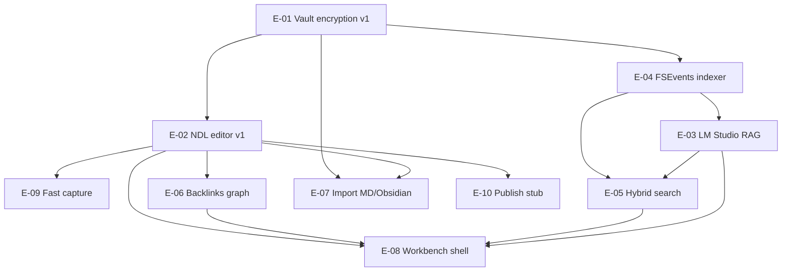

# OpenWrite Phase 2 — Implementation Epics

**Version:** 0.1  
**Last updated:** 2026-05-17  
**Scope:** Post–Phase 1 delivery wave (master plan **v1**, plus selected **v2** stubs)  
**Inputs:** [OpenWriteMasterPlan.md](./OpenWriteMasterPlan.md) · competitive study P0–P2 (Anytype beat list)

**Product & process docs:** [ProductPhilosophy.md](./ProductPhilosophy.md) · [UserPersonas.md](./UserPersonas.md) · [UserJourneys.md](./UserJourneys.md) · [VersioningFramework.md](./VersioningFramework.md) · [ADRs](./adr/)

---

## How Phase 2 maps to the master plan

| RoadmapEpics (this doc) | [OpenWriteMasterPlan.md](./OpenWriteMasterPlan.md) |
|-------------------------|-----------------------------------------------------|
| **Phase 2** (epics below) | **v1** — full vault crypto, block editor, vector index, Q&A, backlinks, export |
| Phase 1 (complete / in flight) | **MVP** — scaffold, stub crypto, minimal NDL, LM health check |
| Epics marked *v2 stub* | **v2** — publish pipelines, advanced NDL, optional sync |

**North-star metrics** (from master plan): vault unlock &lt; 2s on Apple Silicon; lossless NDL round-trip; local LM Studio RAG with citations; calmer daily capture than Anytype.

---

## Competitive priority → epics

Priorities come from the Anytype competitive study (*beat Anytype* list). Each epic is tagged **P0**, **P1**, or **P2**.

| Priority | Study theme | Epics |
|----------|-------------|-------|
| **P0** | Credibly compete on privacy, capture, edit, AI, graph | E-01, E-02, E-03, E-06, E-09, E-10 |
| **P1** | Differentiate on search, shell, native UX | E-04, E-05, E-08 |
| **P2** | Parity without cloning Anytype complexity | E-07, E-10 (*stub only*) |

---

## Epic index

| ID | Epic | Priority | Estimate | Master plan |
|----|------|----------|----------|-------------|
| E-01 | [Vault encryption v1](#e-01-vault-encryption-v1) | P0 | L | v1 — Full vault encryption |
| E-02 | [NDL editor v1](#e-02-ndl-editor-v1) | P0 | L | v1 — Block editor |
| E-03 | [LM Studio RAG](#e-03-lm-studio-rag) | P0 | L | v1 — Vector index, Q&A, related notes |
| E-04 | [FSEvents indexer](#e-04-fsevents-indexer) | P1 | M | v1 — Search / index layer (implicit) |
| E-05 | [Hybrid search](#e-05-hybrid-search) | P1 | M | v1 — Semantic search |
| E-06 | [Backlinks graph](#e-06-backlinks-graph) | P0 | M | v1 — Backlinks graph view |
| E-07 | [Import Markdown / Obsidian](#e-07-import-markdown--obsidian) | P2 | M | v1 export + P2 import |
| E-08 | [AFFiNE-style workbench shell](#e-08-affine-style-workbench-shell) | P1 | L | Architecture — UI shell |
| E-09 | [Fast capture](#e-09-fast-capture) | P0 | M | Success criteria — faster than Anytype |
| E-10 | [Publish pipeline stub](#e-10-publish-pipeline-stub) | P2 | S | v2 — Publish pipelines |

**Epic count:** 10

---

## Dependency overview

**Suggested delivery order:** E-01 → E-02 ∥ E-09 → E-04 → E-06 → E-03 → E-05 → E-08 → E-07 → E-10.

---

## Epics (detail)

### E-01 Vault encryption v1

| Field | Detail |
|-------|--------|
| **Priority** | P0 |
| **Estimate** | **L** |
| **Master plan** | [v1 — Full vault encryption](./OpenWriteMasterPlan.md#v1) · [Privacy model](./OpenWriteMasterPlan.md#privacy-model) · [Vault bundle](./OpenWriteMasterPlan.md#vault-bundle-v0-sketch) |

**Goal:** Replace `NoOpEncryptionService` with CryptoKit AEAD; implement real `.openwrite` bundle I/O (manifest + encrypted `.owdoc`); Keychain-backed unlock with lock-on-sleep.

**Dependencies:** Phase 1 scaffold (`VaultStore.sealedPayload`, `EncryptionService` protocol).

**Swift modules** (`OpenWrite/OpenWrite/`):

| Path | Role |
|------|------|
| `Core/Crypto/EncryptionService.swift` | `CryptoKitEncryptionService`, salt, per-vault key derivation |
| `Core/Vault/VaultStore.swift` | Open/save bundle, document registry, atomic writes |
| `Models/VaultDocument.swift` | Serialization envelope metadata |
| `App/OpenWriteApp.swift` | Lock lifecycle, vault unlock UI hook |
| `UI/ContentView.swift` | Create/open vault flows |

**Acceptance criteria:**

- [ ] User creates vault with passphrase; key material only in Keychain after unlock.
- [ ] `manifest.json` plaintext; each `documents/{uuid}.owdoc` is AEAD-encrypted (ChaCha20-Poly1305 or AES-GCM).
- [ ] Round-trip: edit note → save → quit → reopen → identical `VaultDocument` tree.
- [ ] Lock clears derived keys; reopen requires passphrase or Touch ID–wrapped key (stretch goal).
- [ ] Cold open on M-series Mac ≤ 2s with warm Keychain (master plan metric).

---

### E-02 NDL editor v1

| Field | Detail |
|-------|--------|
| **Priority** | P0 |
| **Estimate** | **L** |
| **Master plan** | [NDL v0 spec](./OpenWriteMasterPlan.md#note-dsl-spec-v0-draft) · [v1 — Block editor](./OpenWriteMasterPlan.md#v1) |

**Goal:** Lossless NDL v0 parse/serialize and a block-oriented editing surface (not plain `TextEditor` on raw NDL strings).

**Dependencies:** E-01 (encrypted persistence).

**Swift modules:**

| Path | Role |
|------|------|
| `NoteDSL/NoteBlock.swift` | AST kinds, attributes |
| `NoteDSL/NDLParser.swift` | Extend stub — line-oriented parser |
| `NoteDSL/NoteBlock.swift` | `NDLSerializer` — round-trip tests |
| `UI/EditorView.swift` | Block list UI, focus, keyboard shortcuts |
| `Models/VaultDocument.swift` | Dirty tracking, `updatedAt` |
| `Core/Vault/VaultStore.swift` | Persist on save |

**Acceptance criteria:**

- [ ] All v0 block kinds round-trip: paragraph, h1–h3, bullet, quote, code fence, divider, `[[title\|uuid]]` wikilink.
- [ ] One-level child indent (2 spaces) preserved.
- [ ] Undo for block insert/delete/reorder (in-memory stack minimum).
- [ ] Save writes encrypted blob via E-01; no plaintext `.owdoc` on disk.

---

### E-03 LM Studio RAG

| Field | Detail |
|-------|--------|
| **Priority** | P0 |
| **Estimate** | **L** |
| **Master plan** | [AI / LM Studio](./OpenWriteMasterPlan.md#ai--lm-studio) · [Data flow — AI path](./OpenWriteMasterPlan.md#data-flow-ai-path--mvp-stub) · Reor-aligned table |

**Goal:** Reor-style local RAG: per-note embeddings, related-notes sidebar, Q&A with citations to block/document IDs via LM Studio.

**Dependencies:** E-01, E-04 (chunk source), E-02 (block IDs for citations).

**Swift modules:**

| Path | Role |
|------|------|
| `AI/LMStudioClient.swift` | Chat completions, streaming (v1), embeddings endpoint |
| `AI/LMStudioConfig.swift` | Model id, timeouts |
| `AI/RAGService.swift` | Extend stub — retrieve → prompt → citations |
| `Core/Indexing/IndexerService.swift` | Vector + lexical index backing store |
| `UI/ContentView.swift` | AI panel, related sidebar |
| `UI/EditorView.swift` | Insert citation link from AI result |

**Acceptance criteria:**

- [ ] Embeddings stored under vault `index/` (encrypted metadata per master plan sketch).
- [ ] “Related notes” shows top-k neighbors for active document.
- [ ] Q&A panel answers from retrieved chunks only; UI lists `documentId` + `blockId` citations.
- [ ] All inference to user-configured `localhost` (no default cloud).
- [ ] Graceful offline when LM Studio unreachable.

---

### E-04 FSEvents indexer

| Field | Detail |
|-------|--------|
| **Priority** | P1 (blocks E-03/E-05) |
| **Estimate** | **M** |
| **Master plan** | [Core layer](./OpenWriteMasterPlan.md#layer-diagram-target) · `index/` in vault bundle |

**Goal:** Background indexer: FSEvents on vault bundle path; incremental plaintext extraction post-decrypt for search/RAG; debounced re-embed queue.

**Dependencies:** E-01 (vault path, decrypt for indexing).

**Swift modules:**

| Path | Role |
|------|------|
| `Core/Indexing/IndexerService.swift` | Extend protocol; add `FSEventsIndexer` impl |
| `Core/Indexing/FSEventsIndexer.swift` | *new* — watch `*.owdoc`, coalesce events |
| `Core/Vault/VaultStore.swift` | Notify indexer on in-app saves |
| `App/OpenWriteApp.swift` | Start/stop indexer with vault session |

**Acceptance criteria:**

- [ ] External touch to vault files triggers re-index within 2s (debounced).
- [ ] In-app save does not double-index (single coalesced pass).
- [ ] Index state persisted under `MyVault.openwrite/index/`.
- [ ] Indexer idle CPU &lt; 5% on 1k-note fixture (manual benchmark).

---

### E-05 Hybrid search

| Field | Detail |
|-------|--------|
| **Priority** | P1 |
| **Estimate** | **M** |
| **Master plan** | [v1 — Semantic search](./OpenWriteMasterPlan.md#v1) · competitive P1 #8 |

**Goal:** Unified search: BM25/keyword over index + semantic k-NN over embeddings; ranked merge (hybrid).

**Dependencies:** E-04, E-03 (embedding vectors).

**Swift modules:**

| Path | Role |
|------|------|
| `Core/Retrieval/RetrievalService.swift` | Hybrid query API |
| `Core/Retrieval/HybridRanker.swift` | Fusion ranking (extend stub) |
| `Core/Indexing/IndexerService.swift` | Postings / metadata access |
| `Core/Indexing/IndexerService.swift` | Vector query backing store |
| `UI/ContentView.swift` | Search field, result list → open note |

**Acceptance criteria:**

- [ ] Query returns results in &lt; 300ms on 1k-note fixture (indexed, warm).
- [ ] Toggle or auto-blend: keyword-only, semantic-only, hybrid default.
- [ ] Snippet shows heading + matching line; opens correct document.

---

### E-06 Backlinks graph

| Field | Detail |
|-------|--------|
| **Priority** | P0 |
| **Estimate** | **M** |
| **Master plan** | [v1 — Backlinks graph view](./OpenWriteMasterPlan.md#v1) · [Wikilink kind](./OpenWriteMasterPlan.md#block-kinds-v0) |

**Goal:** Extract wikilinks from NDL; maintain forward/backlink index; read-only graph visualization.

**Dependencies:** E-02 (wikilink blocks), E-04 (optional: index-backed graph rebuild).

**Swift modules:**

| Path | Role |
|------|------|
| `Core/Graph/BacklinkIndex.swift` | Extend stub — adjacency, resolve titles → UUID |
| `Core/Graph/BacklinkResolver.swift` | *new* — parse `NoteBlock` trees |
| `NoteDSL/NoteBlock.swift` | Wikilink parsing contract |
| `UI/GraphView.swift` | *new* — SwiftUI + AppKit bridge for force layout |
| `UI/EditorView.swift` | Backlinks inspector panel |

**Acceptance criteria:**

- [ ] Backlinks panel lists inbound links for active note.
- [ ] Graph view shows nodes = documents, edges = wikilinks (read-only, pan/zoom).
- [ ] Broken `[[title]]` shows unresolved state, not crash.
- [ ] Rebuild graph from full vault scan &lt; 5s for 1k notes.

---

### E-07 Import Markdown / Obsidian

| Field | Detail |
|-------|--------|
| **Priority** | P2 |
| **Estimate** | **M** |
| **Master plan** | Competitive P2 #16 · [Principles — Markdown as export](./OpenWriteMasterPlan.md#principles) |

**Goal:** One-shot import: folder of `.md` → `VaultDocument` + NDL blocks; map `[[wikilinks]]` and `#tags` into metadata.

**Dependencies:** E-01, E-02 (target schema).

**Swift modules:**

| Path | Role |
|------|------|
| `Import/MarkdownImporter.swift` | Extend — CommonMark subset → NDL |
| `Import/ObsidianImporter.swift` | *new* — frontmatter, attachment paths |
| `NoteDSL/NDLParser.swift` | Shared block construction |
| `Core/Vault/VaultStore.swift` | Bulk insert |
| `UI/ContentView.swift` | Import wizard (folder picker) |

**Acceptance criteria:**

- [ ] Import 100+ files without UI freeze (background `Task`).
- [ ] Headings, lists, fences, and `[[links]]` map to v0 NDL kinds.
- [ ] Obsidian YAML frontmatter → `VaultDocument.metadata`.
- [ ] Import report: created / skipped / failed counts.

---

### E-08 AFFiNE-style workbench shell

| Field | Detail |
|-------|--------|
| **Priority** | P1 |
| **Estimate** | **L** |
| **Master plan** | [Composable blocks](./OpenWriteMasterPlan.md#principles) · AFFiNE study (clean room) |

**Goal:** Three-pane workbench: sidebar (vault tree + search), center editor, right rail (related / AI / backlinks). View-island pattern — editor, graph, and AI are swappable destinations without Electron.

**Dependencies:** E-02, E-06, E-03, E-05 (panels consume their data).

**Swift modules:**

| Path | Role |
|------|------|
| `UI/ContentView.swift` | `NavigationSplitView` → workbench coordinator |
| `UI/Workbench/WorkbenchState.swift` | Extend — layout, rail tabs, keyboard routing |
| `UI/Workbench/SidebarSection.swift` | Sidebar sections |
| `UI/EditorView.swift` | Center island |
| `UI/GraphView.swift` | Graph island |
| `App/OpenWriteApp.swift` | Window chrome, commands menu |

**Acceptance criteria:**

- [ ] Sidebar: documents, pinned, search entry (E-05).
- [ ] Right rail tabs: Related (E-03), Backlinks (E-06), AI Q&A (E-03).
- [ ] ⌘1/2/3 switches center island: Editor / Graph / (future canvas stub disabled).
- [ ] State restores on relaunch (selected doc, active tab).

---

### E-09 Fast capture

| Field | Detail |
|-------|--------|
| **Priority** | P0 |
| **Estimate** | **M** |
| **Master plan** | Success criteria — faster than Anytype · Buffer capture lineage |

**Goal:** Sub-second capture: global hotkey or menu-bar extra → inbox note append (today’s daily or dedicated Inbox doc); minimal chrome.

**Dependencies:** E-01, E-02 (write path).

**Swift modules:**

| Path | Role |
|------|------|
| `UI/Capture/QuickCaptureController.swift` | Extend — floating panel, hotkey |
| `Core/Vault/VaultStore.swift` | Inbox routing, append block API |
| `App/OpenWriteApp.swift` | `NSStatusItem` or `MenuBarExtra`, hotkey registration |
| `Models/VaultDocument.swift` | `metadata["inbox"]` or daily note convention |

**Acceptance criteria:**

- [ ] Global shortcut opens capture from any app (sandbox permitting).
- [ ] Submit appends paragraph block to inbox &lt; 500ms perceived.
- [ ] No type picker — plain text → paragraph NDL block.
- [ ] Works while vault locked? **No** — prompt unlock once, then capture (documented).

---

### E-10 Publish pipeline stub

| Field | Detail |
|-------|--------|
| **Priority** | P2 (*v2 stub*) |
| **Estimate** | **S** |
| **Master plan** | [v2 — Publish pipelines](./OpenWriteMasterPlan.md#v2) · Buffer-style workflows |

**Goal:** Define pipeline types and dry-run export only — no network posting. Buffer mental model: draft → channel template.

**Dependencies:** E-02 (NDL → export views).

**Swift modules:**

| Path | Role |
|------|------|
| `Core/Publish/PublishPipeline.swift` | *new* — protocol + `MarkdownPublishTarget` stub |
| `NoteDSL/NDLSerializer.swift` | Export serialization |
| `UI/ContentView.swift` | “Export for publish…” menu (disabled targets OK) |

**Acceptance criteria:**

- [ ] `PublishPipeline` protocol: `name`, `supportedFormats`, `render(_: VaultDocument) -> Data`.
- [ ] Built-in stub targets: Markdown file, plain text (write to `~/Downloads` only).
- [ ] UI shows pipeline picker; **no** OAuth or API keys.
- [ ] Unit test: sample doc → Markdown bytes match golden file.

---

## Estimate legend

| Size | Indicative effort |
|------|-----------------|
| **S** | 1–3 days |
| **M** | 1–2 weeks |
| **L** | 2–4 weeks |
| **XL** | 4+ weeks (none in Phase 2 scope) |

---

## Critical path (top 5)

Items that gate the P0 “beat Anytype” story and unblock the most downstream epics:

1. **E-01 Vault encryption v1** — Without real at-rest crypto and bundle I/O, nothing else is credible vs Anytype’s encryption narrative.
2. **E-02 NDL editor v1** — Canonical content model; blocks citations, wikilinks, and graph.
3. **E-09 Fast capture** — P0 user-visible win (“faster than Anytype”); depends on E-01/E-02 only.
4. **E-04 FSEvents indexer** — Feeds hybrid search and RAG chunk refresh; parallelize UI after E-02.
5. **E-03 LM Studio RAG** — Core differentiator vs Anytype; requires indexer + editor block IDs.

*Near-critical:* E-06 Backlinks graph (P0 graph expectation) and E-08 Workbench shell (integrates panels once E-03/E-05/E-06 exist).

---

## Out of scope (Phase 2)

- P2P / AnySync-style mesh sync (master plan v2).
- Full Anytype type/relation algebra, kanban, DB views.
- Edgeless canvas / whiteboard (AFFiNE non-goal).
- Plugin sandbox (v2+).
- Shipping vendored `reor-main/` or `AFFiNE-canary/` code — [Reference trees policy](./OpenWriteMasterPlan.md#legal--compliance) applies.

---

## Existing scaffold seams (Phase 1 → Phase 2)

Protocol stubs already in `OpenWrite/OpenWrite/` — implement in place, do not duplicate:

| File | Seam |
|------|------|
| `Core/Indexing/IndexerService.swift` | `IndexerService` |
| `Core/Retrieval/RetrievalService.swift` | `RetrievalService` |
| `Core/Graph/BacklinkIndex.swift` | `BacklinkIndex` |
| `AI/RAGService.swift` | `RAGService` |
| `UI/Workbench/WorkbenchState.swift` | Workbench coordinator state |
| `UI/Capture/QuickCaptureController.swift` | Fast capture entry |
| `Import/MarkdownImporter.swift` | Import pipeline entry |
| `NoteDSL/NDLParser.swift` | NDL parse (extend for E-02) |

---

*Owner: OpenWrite core. Update when master plan v1/v2 boundaries shift.*
