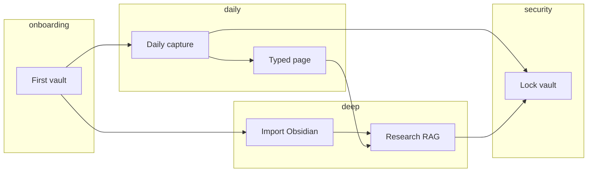

# OpenWrite User Journeys

**Version:** 1.0  
**Last updated:** 2026-05-17  
**Related:** [UserPersonas.md](./UserPersonas.md) · [ProductPhilosophy.md](./ProductPhilosophy.md) · [OpenWriteMasterPlan.md](./OpenWriteMasterPlan.md) · [RoadmapEpics.md](./RoadmapEpics.md)

---

## Overview

These journeys describe **end-to-end flows** a user experiences in OpenWrite v1. They tie UX steps to engineering epics so design reviews and acceptance criteria stay aligned. Personas from [UserPersonas.md](./UserPersonas.md) appear in parentheses where one persona is the primary driver.

**Legend:** Steps marked *(planned)* depend on Phase 2 epics not yet complete in the scaffold; steps marked *(stub)* exist in code but need full implementation per [RoadmapEpics.md](./RoadmapEpics.md).

---

## Journey 1: First vault — “I own my corpus”

**Primary personas:** Sam (student), Alex (privacy)  
**Epics:** [E-01 Vault encryption v1](./RoadmapEpics.md#e-01-vault-encryption-v1)  
**Master plan:** [Success criteria](./OpenWriteMasterPlan.md#vision), [Vault bundle v0](./OpenWriteMasterPlan.md#vault-bundle-v0)

### Trigger

User installs OpenWrite, launches for the first time, and wants a place for notes that is **not** iCloud Documents plain text or an account-based app.

### Flow

1. **Welcome** — App explains: one vault, local disk, optional LM Studio later. No sign-in screen.
2. **Create vault** — User chooses name and location (e.g. `~/Documents/Research.openwrite`). Sets passphrase.
3. **Key derivation** — Passphrase → Keychain-wrapped vault key; salt stored in `manifest.json` (no secrets in manifest).
4. **First document** — App creates `Welcome` note or empty inbox; user sees workbench shell *(E-08)*.
5. **Confirm lock** — User chooses lock timeout (e.g. on sleep); app documents behavior in Settings.

### Success criteria

- Cold unlock ≤ 2 seconds on Apple Silicon with warm Keychain ([master plan metric](./OpenWriteMasterPlan.md#vision)).
- No network required for steps 1–5.
- `documents/*.owdoc` on disk are not readable without unlock.

### Failure modes

| Failure | User experience | Mitigation |
|---------|-------------------|------------|
| Forgot passphrase | Cannot recover vault | Clear copy: no cloud reset |
| Chose wrong folder | Vault in unexpected path | Show full path in settings |
| Keychain denied | Cannot save key | Sandbox / entitlement fix |

### Related ADR

[ADR 0001: Local-only architecture](./adr/0001-local-only-architecture.md)

---

## Journey 2: Daily capture — “Thought before context switch”

**Primary personas:** Jordan (writer), Sam (student)  
**Epics:** [E-09 Fast capture](./RoadmapEpics.md#e-09-fast-capture), [E-02 NDL editor v1](./RoadmapEpics.md#e-02-ndl-editor-v1)  
**Philosophy:** [Beat Anytype on capture](./ProductPhilosophy.md#3-simplicity-beats-anytypefor-the-jobs-people-actually-do-daily)

### Trigger

User is in another app (browser, PDF, meeting) and has a fleeting idea.

### Flow

1. **Hotkey** — Global shortcut opens minimal capture panel *(E-09)*.
2. **Unlock if needed** — If vault locked, single unlock prompt; then capture proceeds (documented: no capture while locked without unlock).
3. **Type and submit** — Plain text → new **paragraph** block appended to Inbox or today’s daily note (`metadata` convention).
4. **Dismiss** — Panel closes; user returns to prior app in &lt; 500 ms perceived.
5. **Later triage** — User opens main app, moves bullets under headings, adds wikilinks *(E-02)*.

### Success criteria

- No type picker, no template wizard at capture time.
- Append persists through E-01 encrypted save path.
- Inbox discoverable in sidebar ([E-08](./RoadmapEpics.md#e-08-affine-style-workbench-shell)).

### Failure modes

| Failure | Mitigation |
|---------|------------|
| Vault locked | One-time unlock; remember session |
| Hotkey blocked by sandbox | Document entitlement; fallback menu-bar item |
| Wrong target note | Settings: Inbox vs daily journal |

---

## Journey 3: Research session with RAG — “Ask my vault”

**Primary personas:** Mara (researcher), Alex (privacy)  
**Epics:** [E-03 LM Studio RAG](./RoadmapEpics.md#e-03-lm-studio-rag), [E-04 FSEvents indexer](./RoadmapEpics.md#e-04-fsevents-indexer), [E-05 Hybrid search](./RoadmapEpics.md#e-05-hybrid-search)  
**ADR:** [ADR 0003: Reor-style RAG in Swift](./adr/0003-reor-rag-in-swift.md)

### Trigger

User has weeks of notes on a topic and wants synthesis with **verifiable citations**, using a local model.

### Preconditions

- Vault unlocked.
- LM Studio running with chat + embeddings models configured ([AI / LM Studio](./OpenWriteMasterPlan.md#ai--lm-studio)).
- Index built under `MyVault.openwrite/index/` *(E-04)*.

### Flow

1. **Health check** — User confirms green status in AI inspector *(stub: `LMStudioClient.healthCheck`)*.
2. **Open note or global ask** — User types question in Q&A panel.
3. **Retrieve** — `RetrievalService` hybrid search: keyword + semantic top-k chunks ([E-05](./RoadmapEpics.md#e-05-hybrid-search)).
4. **Generate** — `RAGService` sends prompt + chunks to LM Studio; streams answer *(planned)*.
5. **Citations** — UI lists each claim’s `documentId` + `blockId`; user clicks to jump to block in editor.
6. **Related sidebar** — While editing, “Related notes” shows embedding neighbors for active doc *(E-03)*.

### Success criteria

- Answers use **retrieved chunks only** (no silent full-vault dump in prompt without user action).
- Citations map to real NDL block UUIDs ([E-02](./RoadmapEpics.md#e-02-ndl-editor-v1)).
- Offline graceful: clear message if LM Studio unreachable.

### Privacy checkpoint

Alex’s persona requirement: Settings show **what was retrieved** (chunk titles) before send, in a future enhancement; v1 minimum is localhost-only endpoint.

---

## Journey 4: Typed page creation — “Structure without an object OS”

**Primary personas:** Sam (student), Mara (researcher)  
**Epics:** [E-02 NDL editor v1](./RoadmapEpics.md#e-02-ndl-editor-v1)  
**ADR:** [ADR 0002: Typed pages](./adr/0002-typed-pages-object-model.md)

### Trigger

User wants a **Reading** or **Task** page—not a blank generic note—with a few consistent fields.

### Flow

1. **New page** — Sidebar → New → pick template: Note, Task, Reference *(light types, P2 in master plan)*.
2. **Apply template** — `VaultDocument.metadata` sets `template=reading`; editor inserts property blocks or metadata rows (`key:: value` in NDL).
3. **Edit in outliner** — User fills bullets under headings; todos use `- [ ]` kind.
4. **Link** — User adds `[[Other note]]` wikilink blocks for graph edges *(E-06)*.
5. **Save** — Tree serializes to NDL → encrypt → `.owdoc` ([data flow — edit path](./OpenWriteMasterPlan.md#data-flow-edit-path)).

### Success criteria

- No Anytype-style space/type/relation wizard.
- Template fits on one screen; advanced relations deferred.
- Round-trip lossless for template metadata and blocks.

### Contrast with Anytype

We provide **typed pages** (metadata + optional default blocks), not a full **object graph OS**. See [ADR 0002](./adr/0002-typed-pages-object-model.md).

---

## Journey 5: Lock vault — “Walk away safe”

**Primary personas:** Alex (privacy), Sam (student)  
**Epics:** [E-01 Vault encryption v1](./RoadmapEpics.md#e-01-vault-encryption-v1)

### Trigger

User closes laptop, shares machine, or ends work session.

### Flow

1. **Automatic** — On sleep or timeout, app clears derived data key from memory; UI shows locked state.
2. **Manual** — Menu: Lock Vault / ⌘⇧L.
3. **Re-open attempt** — Editor shows lock screen; capture hotkey prompts unlock.
4. **Keychain** — Touch ID–wrapped key *(stretch)* or passphrase re-entry.

### Success criteria

- Locked state: no plaintext NDL in memory; no AI calls until unlock.
- Re-unlock meets &lt; 2 s warm Keychain target.

### Related

[Privacy model — runtime](./OpenWriteMasterPlan.md#privacy-model)

---

## Journey 6: Import Obsidian folder — “Meet me where my notes are”

**Primary personas:** Mara (researcher)  
**Epics:** [E-07 Import Markdown / Obsidian](./RoadmapEpics.md#e-07-import-markdown--obsidian)  
**Master plan:** [P2 import](./OpenWriteMasterPlan.md#p2--selective-parity)

### Trigger

User has `~/Obsidian/Research/` with hundreds of `.md` files, wikilinks, and YAML frontmatter.

### Flow

1. **Import wizard** — File → Import → Obsidian folder…
2. **Pick folder** — User selects vault root; app scans `*.md` recursively.
3. **Background job** — `Task` imports without blocking UI; progress bar.
4. **Map to NDL** — Headings → heading blocks; lists → bullets; `[[links]]` → wikilink blocks; frontmatter → `VaultDocument.metadata` *(MarkdownImporter / ObsidianImporter)*.
5. **Report** — Summary: created / skipped / failed; optional log file.
6. **Re-index** — FSEvents indexer embeds new corpus *(E-04)*; user can run RAG journey.

### Success criteria

- 100+ files without UI freeze ([E-07 acceptance](./RoadmapEpics.md#e-07-import-markdown--obsidian)).
- Wikilinks resolve where title matches imported doc.
- User understands Markdown is **import**, not canonical store ([principles](./OpenWriteMasterPlan.md#principles)).

### Failure modes

| Issue | Handling |
|-------|----------|
| Unsupported embed syntax | Skip with warning in report |
| Duplicate titles | Disambiguate suffix in title metadata |
| Large attachments | Link path in metadata; don’t inline binary in v1 |

---

## Journey map (summary)

---

## Traceability to epics

| Journey | P0/P1/P2 | Epics |
|---------|-----------|-------|
| First vault | P0 | E-01, E-08 |
| Daily capture | P0 | E-09, E-01, E-02 |
| Research RAG | P0 | E-03, E-04, E-05 |
| Typed page | P2 (light v1) | E-02 |
| Lock vault | P0 | E-01 |
| Import Obsidian | P2 | E-07, E-04 |

Delivery order: [RoadmapEpics.md — suggested delivery order](./RoadmapEpics.md#dependency-overview).
