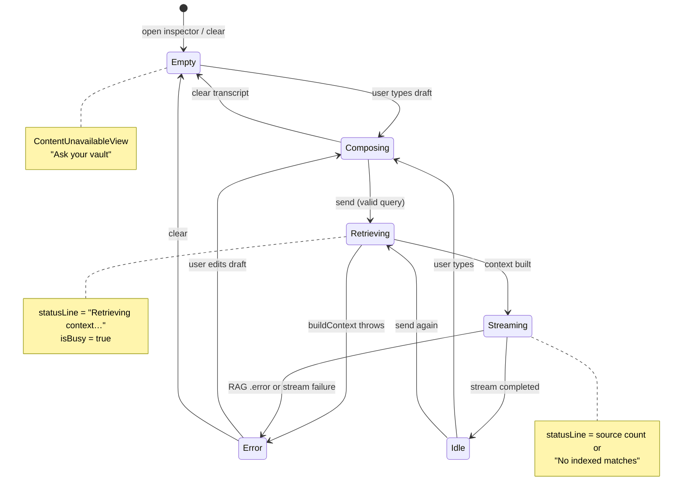
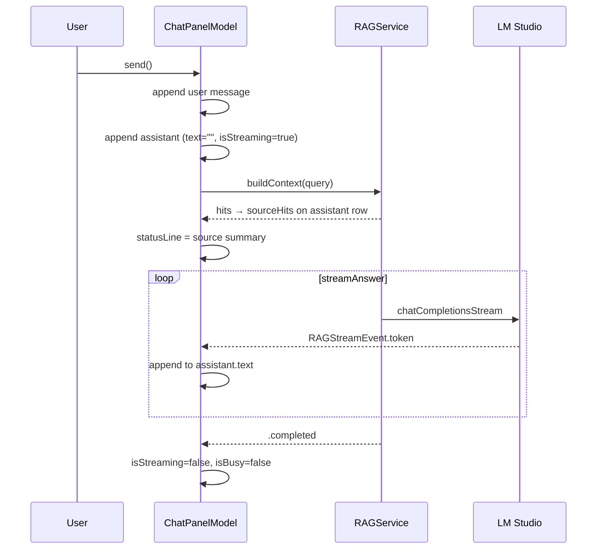
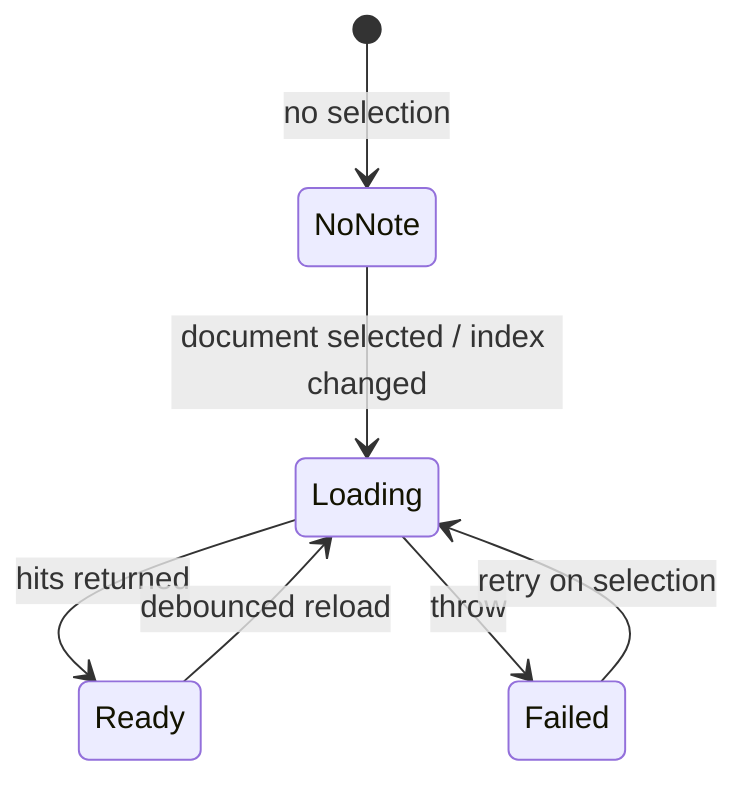

# AI activity states (vault chat)

**Version:** 1.0  
**Last updated:** 2026-05-17  
**Implementation:** `ChatPanelModel` in `UI/AI/ChatPanelView.swift`, `RAGStreamEvent` in `AI/RAGService.swift`

This document defines the **UX state machine** for the inspector **Vault chat** panel. Related-notes loading uses a simpler parallel model (`RelatedNotesModel.isLoading`); see [Components.md § Inspector](./Components.md#inspector).

---

## Actors and state variables

| Variable | Owner | Meaning |
|----------|-------|---------|
| `messages` | `ChatPanelModel` | Transcript (`ChatMessage`: user / assistant / system) |
| `draft` | `ChatPanelModel` | Composer text (cleared on send) |
| `isBusy` | `ChatPanelModel` | Send in flight; disables composer send |
| `statusLine` | `ChatPanelModel` | Header caption: retrieval, source count, or error |
| `isStreaming` | per `ChatMessage` | Assistant bubble still receiving tokens |
| `sourceHits` | per `ChatMessage` | RAG chunks attached after `buildContext` |

---

## Panel-level state machine

### State definitions

| State | UI signals | `isBusy` | `statusLine` |
|-------|------------|----------|--------------|
| **Empty** | `ContentUnavailableView` (sparkles); Clear disabled | `false` | `nil` |
| **Composing** | Draft in `TextField`; send enabled if `AIInput.sanitizeQuery(draft) != nil` | `false` | `nil` |
| **Retrieving** | User bubble appended; assistant placeholder with `…` | `true` | `"Retrieving context…"` |
| **Streaming** | Assistant text grows; optional Sources block | `true` | `"{n} source(s)"` or `"No indexed matches"` |
| **Idle** | Last assistant `isStreaming == false` | `false` | `nil` |
| **Error** | Assistant bubble shows error string; header may say `"Error"` | `false` | `"Error"` |

**Clear** (`ChatPanelModel.clear()`): cancels `streamTask`, wipes `messages`, resets `isBusy` and `statusLine` → **Empty**.

**Resend while busy:** New send cancels prior `streamTask` and appends a fresh user + assistant pair (no queue UI in v1).

---

## Per-message lifecycle (assistant)

### `RAGStreamEvent` mapping

| Event | `ChatPanelModel` effect |
|-------|-------------------------|
| `.token(String)` | Append to current assistant `text` |
| `.citations([UUID])` | No UI update in v1 (hits already on message) |
| `.completed` | `isStreaming = false`, `isBusy = false`, `statusLine = nil` |
| `.error(String)` | Replace assistant `text`, end streaming, `statusLine = "Error"` |
| Thrown error (outer `catch`) | `localizedDescription` on assistant bubble, same as error row |

---

## UI affordances by state

| Element | Empty | Composing | Retrieving / Streaming | Error |
|---------|-------|-----------|------------------------|-------|
| Message list | Placeholder | Prior messages | Auto-scroll to latest (`ScrollViewReader`, 0.2s ease) | Same |
| Assistant placeholder | — | — | `"…"` when `text.isEmpty && isStreaming` | Error text |
| Sources block | — | — | Up to 6 hits under assistant bubble | May still show if context succeeded before stream error |
| Send button | Disabled if draft invalid | Enabled | **Disabled** (`isBusy`) | Enabled when idle |
| Clear | Disabled | Enabled if non-empty | Enabled | Enabled |
| Header status | Hidden | Hidden | Retrieval / count | `"Error"` |

---

## Related notes (parallel, simpler)

`RelatedNotesModel` does not share `ChatPanelModel` state.

| State | UI |
|-------|-----|
| No note | `ContentUnavailableView` — “No note selected” |
| Loading | Header `ProgressView` |
| Ready | `List` of hits with score %; tap opens note |
| Failed | `ContentUnavailableView` — “Could not load” |
| Empty (note selected) | “No related notes yet” |

Debounce: `AISafetyLimits.searchDebounceSeconds` before `load`.

---

## Sidebar AI section (operator, not chat)

Independent of chat state machine:

| Signal | Source |
|--------|--------|
| LM Studio URL / model | `OpenWriteAIServices.lmConfig` |
| Connection caption | `aiServices.lmStatus` |
| Indexed chunks | `indexedChunkCount` |
| Indexing | `isIndexing` + `ProgressView` |

Unreachable LM Studio should disable **Ask** in chat (future: wire `lmStatus` to composer); v1 disables only while `isBusy`.

---

## Accessibility announcements (target)

| Transition | Announcement |
|------------|----------------|
| Retrieving → Streaming | “Answer in progress” (optional; avoid per-token spam) |
| Streaming → Idle | “Answer complete, {n} sources” |
| Error | “Answer failed, {message}” |

Per-token updates are not announced; bubble text is selectable for review.

---

## Future states (not in v1)

| State | Notes |
|-------|-------|
| **Stopped** | User cancels mid-stream; preserve partial assistant text |
| **Unreachable LM** | Composer disabled with link to sidebar Check connection |
| **Indexing** | Chat allowed but banner: “Index updating…” |

---

## Inline refine (separate machine)

Selection refine uses `InlineAssistPhase` (`idle` → `refining` → `ready` \| `failed`), not `ChatPanelModel`. Non-streaming `rag.answer` with `BuiltInAgents.refineProse`. See [InlineAIEditing.md](./InlineAIEditing.md).

---

*See also: [EditorAndAIPanel.md](./EditorAndAIPanel.md) · [Components.md § AI Chat panel](./Components.md#ai-chat-panel) · [Architecture/AI-Pipeline.md](../Architecture/AI-Pipeline.md)*
