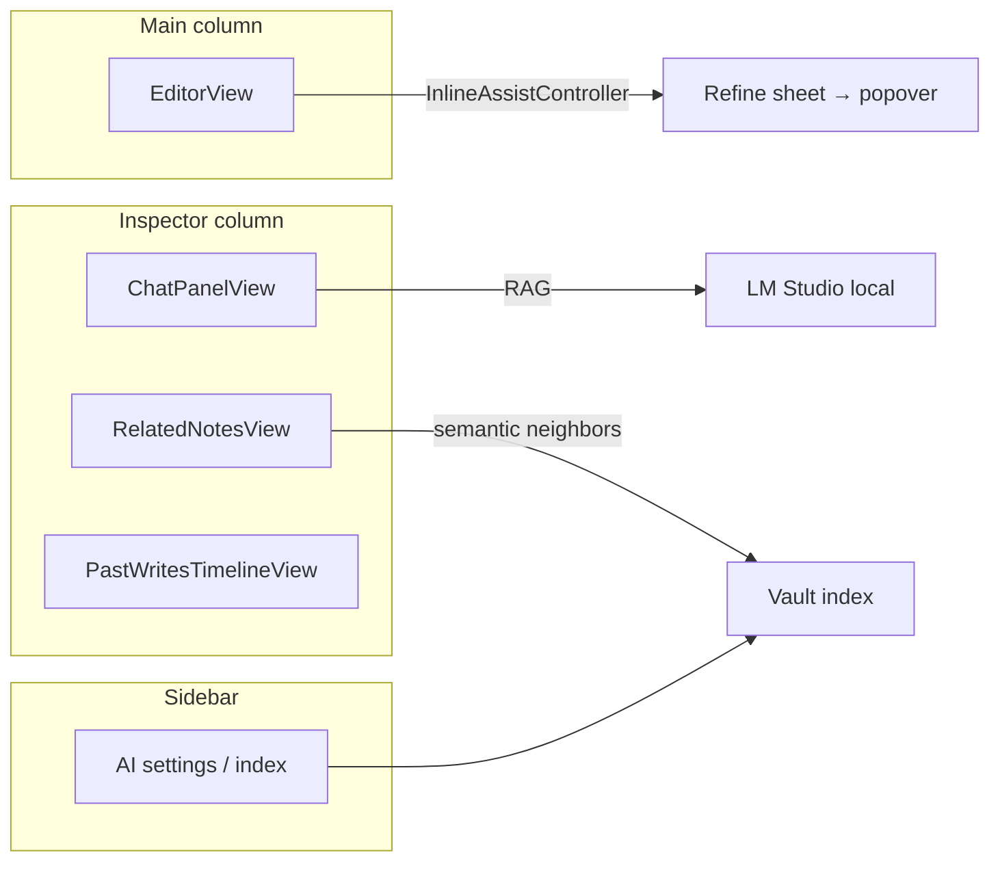

# Editor and AI panel placement

**Version:** 1.2  
**Last updated:** 2026-05-17  
**Status:** Decided — implemented in workbench v2 (assist strip)  
**Code:** `ContentView.swift`, `AnytypeShellView.swift`, `AIAssistStripView.swift`, `ChatPanelView.swift`, `EditorView.swift`

---

## Decision summary

| Surface | Placement | Rationale |
|---------|-----------|-----------|
| **Vault chat (RAG Q&A)** | Trailing **AI assist strip** (`AIAssistStripView` → `ChatPanelView`) when `WorkbenchState.aiAssistExpanded` | Reor-narrow column (~240–360pt); collapsed by default via bottom bar. |
| **Related notes** | Assist strip stack (`RelatedNotesView`) | Contextual to the open note; debounced retrieval on selection change. |
| **Past Writes** | Assist strip stack (`PastWritesTimelineView`) | Timeline is reference material, not inline editing. |
| **Selection refine / rewrite (v1)** | **Inline** — toolbar **Refine** + result **sheet** (`InlineAssistController`) | Keeps author in flow; see [InlineAIEditing.md](./InlineAIEditing.md). |
| **LM Studio / index controls** | **Settings** sheet (`OpenWriteSettingsView` / `AISettingsView`) | Operator config, not rail chrome. |

**Author-first rule:** The center column stays the hero (`EditorView`). Vault Q&A lives in the optional assist strip; AI that changes the current note uses selection refine in the editor column.

**Legacy note:** Early docs described a `NavigationSplitView` **inspector** column (`WorkbenchInspectorView`). That layout was replaced by the center card + collapsible assist strip — do not reintroduce a third permanent column without product review.

---

## Options considered

### A — Full-screen or column overlay

A sheet or dimmed overlay over the editor for every AI action.

| Pros | Cons |
|------|------|
| Maximum space for long answers | Breaks writing flow; feels like “another app” |
| Simple to implement once | Hides document context while chatting |

**Verdict:** Rejected for vault chat. Acceptable only for rare flows (e.g. first-run LM setup), not daily Q&A.

### B — Floating chat bubble (corner dock)

A collapsible bubble (messages app style) over the editor corner.

| Pros | Cons |
|------|------|
| Always one click away | Obscures text; poor on small windows |
| Familiar from web assistants | Hard to show citation lists and source cards |

**Verdict:** Rejected for v1. Bubbles work for short hints, not RAG with 6+ source snippets.

### C — Split assist strip (chosen for chat)

`AnytypeShellView` hosts a center **editor card** and an optional trailing **assist strip** (`OWResizableColumnSplit`, fixed trailing column).

```
┌ Rail ──┬── Editor card (EditorView) ──┬── Assist strip (optional) ─┐
│ OBJECTS│  page header + blocks         │ Chat / Related / Past Writes│
│ …      │                               │ 2×2 composer board          │
└────────┴───────────────────────────────┴─────────────────────────────┘
         ▲ collapsed: AIAssistBottomBar expands strip
```

| Pros | Cons |
|------|------|
| Editor remains primary; strip capped at `assistStripMaxWidth` | User must expand assist (default off) |
| Citations and related notes share strip chrome | Narrow windows auto-collapse strip (`OWShellLayout`) |

**Verdict:** **Chosen** for vault chat, related notes, and Past Writes. Toggle via `AIAssistBottomBar` / strip header close (`WorkbenchState.aiAssistExpanded`).

### D — Inline at selection (chosen for refine v1)

Selection-scoped **refine** via `InlineAssistController` + `SelectablePlainTextEditor` (AppKit selection bridge). **Design target:** `.popover` anchored to selection with Apply. **v1 scaffold:** header **Refine selection** button + `.sheet` showing result (read-only; no Apply merge yet).

| Pros | Cons |
|------|------|
| Zero column cost | Sheet is heavier than popover until migrated |
| Clear “this changes my text” semantics | Apply-to-selection not wired in v1 sheet |
| Async refine does not block typing | |

**Verdict:** **Chosen** for inline assist only; do not duplicate chat in the sheet/popover.

---

## Layout wiring (implemented)

| Layer | Type | Responsibility |
|-------|------|----------------|
| Root | `NavigationSplitView` | Sidebar \| content \| detail (inspector) |
| Content | `editorColumn` | `EditorView` + inspector show/hide affordance |
| Detail | `WorkbenchInspectorView` | Segmented `InspectorTab` + panel body |
| Chat | `ChatPanelView` + `ChatPanelModel` | Messages, RAG stream, composer |
| Editor | `EditorView` | Plain-text edit, preview toggle, typed-page chrome |

**Widths (code today):**

- Inspector: `minWidth: 300`, `idealWidth: 340` (`WorkbenchInspectorView`)
- Chat panel body: `minWidth: 280` (`ChatPanelView`)
- Sidebar: `minWidth: 240` (`ContentView`)

Future: collapse inspector below ~900pt window width per [Components.md § Workbench shell](./Components.md#workbench-shell).

### Block editor engine (AppKit host)

| Piece | Role |
|-------|------|
| `EditorView` | `OpenWriteThemedScrollView(scrollToken: editorScrollLayoutToken)` — remeasures on assist/rail width changes; **does not** scroll-to-bottom on token change (chat-only). |
| `OWBlockEditorView` | `BlockEditorPasteCaptureView` + inner `NSHostingView` — block rows stay alive across keystrokes; **structure revision** excludes `text` and `checked` so typing/todo toggles do not remeasure the host. |
| `OWBlockTextEditor` | Per-block `NSTextView`; strikethrough for todos applied in-place when only checkbox state changes. |
| `OpenWriteThemedScrollView` | Measure pass restores the live hosting frame after probing; document resize preserves `contentView.bounds.origin` (no snap-back during scroll). |

---

## What lives where (product map)



---

## Keyboard and focus (target)

| Action | Shortcut | Status |
|--------|----------|--------|
| Toggle inspector | `Cmd+Option+I` | Help on toggle button; shortcut TBD |
| Send chat | `Cmd+Return` | Implemented in `ChatPanelView` composer |
| Focus composer | `Cmd+Shift+A` (proposed) | Not implemented |

Focus order: sidebar → editor → inspector panel. When inspector is hidden, focus returns to editor.

---

## Migration notes

- Older docs referenced AI only in `ContentView` sidebar; **connection and index UI remain there** while **conversation moved to inspector**.
- Planned paths in master plan (`UI/Inspector/ChatPanel.swift`) map to `UI/AI/ChatPanelView.swift` and `UI/Workbench/WorkbenchInspectorView.swift`.

---

*See also: [Components.md](./Components.md) · [AIActivityStates.md](./AIActivityStates.md) · [InlineAIEditing.md](./InlineAIEditing.md) · [Architecture/AI-Pipeline.md](../Architecture/AI-Pipeline.md)*
