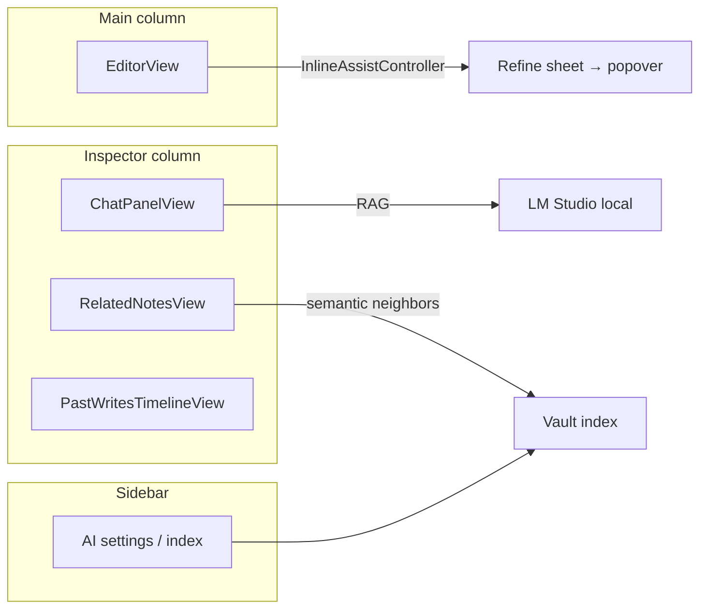

# Editor and AI panel placement

**Version:** 1.0  
**Last updated:** 2026-05-17  
**Status:** Decided — implemented in workbench v1  
**Code:** `ContentView.swift`, `EditorView.swift`, `WorkbenchInspectorView.swift`, `ChatPanelView.swift`

---

## Decision summary

| Surface | Placement | Rationale |
|---------|-----------|-----------|
| **Vault chat (RAG Q&A)** | Trailing **inspector** tab (`InspectorTab.chat` → `ChatPanelView`) | Long transcripts, citations, and composer need stable width; must not cover the editor. |
| **Related notes** | Inspector tab (`InspectorTab.related` → `RelatedNotesView`) | Contextual to the open note; debounced retrieval on selection change. |
| **Past Writes** | Inspector tab (`InspectorTab.pastWrites` → `PastWritesTimelineView`) | Timeline is reference material, not inline editing. |
| **Selection refine / rewrite (v1)** | **Inline** at selection — **target:** popover; **shipped:** toolbar + result **sheet** | Keeps author in flow; see [InlineAIEditing.md](./InlineAIEditing.md). |
| **LM Studio / index controls** | Sidebar **AI** section (for now) | Operator settings, not conversational UI. |

**Author-first rule:** The center column stays the hero (`EditorView`). AI that answers questions about the vault lives in the inspector; AI that changes the current note appears at the selection.

---

## Options considered

### A — Full-screen or column overlay

A sheet or dimmed overlay over the editor for every AI action.

| Pros | Cons |
|------|------|
| Maximum space for long answers | Breaks writing flow; feels like “another app” |
| Simple to implement once | Hides document context while chatting |

**Verdict:** Rejected for vault chat. Acceptable only for rare flows (e.g. first-run LM setup), not daily Q&A.

### B — Floating chat bubble (corner dock)

A collapsible bubble (messages app style) over the editor corner.

| Pros | Cons |
|------|------|
| Always one click away | Obscures text; poor on small windows |
| Familiar from web assistants | Hard to show citation lists and source cards |

**Verdict:** Rejected for v1. Bubbles work for short hints, not RAG with 6+ source snippets.

### C — Split inspector (chosen for chat)

`NavigationSplitView` **detail** column hosts `WorkbenchInspectorView` with a segmented tab picker.

```
┌ Sidebar ──┬── Editor (content) ──┬── Inspector ─────────────┐
│ Vault     │  EditorView           │ [Chat|Related|Past Writes]│
│ list      │  title + properties   │  active panel             │
│           │  TextEditor / preview │                           │
└───────────┴───────────────────────┴───────────────────────────┘
```

| Pros | Cons |
|------|------|
| Editor remains fully visible | Uses horizontal space (~300–340pt) |
| Citations and related notes share one chrome pattern | User must open inspector (default: visible) |
| Matches macOS `NavigationSplitView` mental model | |

**Verdict:** **Chosen** for vault chat, related notes, and Past Writes. Toggle via edge control in `ContentView` (`workbench.inspectorVisible`, 0.2s ease).

### D — Inline at selection (chosen for refine v1)

Selection-scoped **refine** via `InlineAssistController` + `SelectablePlainTextEditor` (AppKit selection bridge). **Design target:** `.popover` anchored to selection with Apply. **v1 scaffold:** header **Refine selection** button + `.sheet` showing result (read-only; no Apply merge yet).

| Pros | Cons |
|------|------|
| Zero column cost | Sheet is heavier than popover until migrated |
| Clear “this changes my text” semantics | Apply-to-selection not wired in v1 sheet |
| Async refine does not block typing | |

**Verdict:** **Chosen** for inline assist only; do not duplicate chat in the sheet/popover.

---

## Layout wiring (implemented)

| Layer | Type | Responsibility |
|-------|------|----------------|
| Root | `NavigationSplitView` | Sidebar \| content \| detail (inspector) |
| Content | `editorColumn` | `EditorView` + inspector show/hide affordance |
| Detail | `WorkbenchInspectorView` | Segmented `InspectorTab` + panel body |
| Chat | `ChatPanelView` + `ChatPanelModel` | Messages, RAG stream, composer |
| Editor | `EditorView` | Plain-text edit, preview toggle, typed-page chrome |

**Widths (code today):**

- Inspector: `minWidth: 300`, `idealWidth: 340` (`WorkbenchInspectorView`)
- Chat panel body: `minWidth: 280` (`ChatPanelView`)
- Sidebar: `minWidth: 240` (`ContentView`)

Future: collapse inspector below ~900pt window width per [Components.md § Workbench shell](./Components.md#workbench-shell).

---

## What lives where (product map)



---

## Keyboard and focus (target)

| Action | Shortcut | Status |
|--------|----------|--------|
| Toggle inspector | `Cmd+Option+I` | Help on toggle button; shortcut TBD |
| Send chat | `Cmd+Return` | Implemented in `ChatPanelView` composer |
| Focus composer | `Cmd+Shift+A` (proposed) | Not implemented |

Focus order: sidebar → editor → inspector panel. When inspector is hidden, focus returns to editor.

---

## Migration notes

- Older docs referenced AI only in `ContentView` sidebar; **connection and index UI remain there** while **conversation moved to inspector**.
- Planned paths in master plan (`UI/Inspector/ChatPanel.swift`) map to `UI/AI/ChatPanelView.swift` and `UI/Workbench/WorkbenchInspectorView.swift`.

---

*See also: [Components.md](./Components.md) · [AIActivityStates.md](./AIActivityStates.md) · [InlineAIEditing.md](./InlineAIEditing.md) · [Architecture/AI-Pipeline.md](../Architecture/AI-Pipeline.md)*
