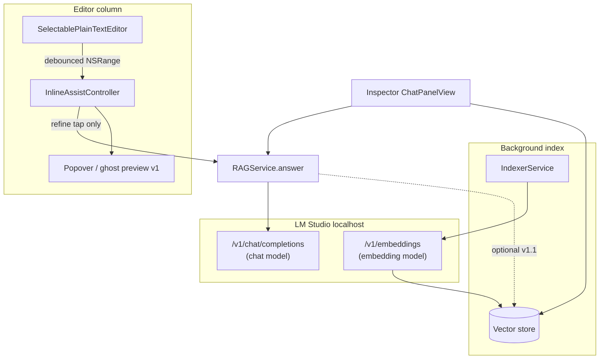

# Inline AI editing — Google Docs research & local-model patterns

**Version:** 1.0  
**Last updated:** 2026-05-17  
**Status:** Research / design input (not a shipping spec by itself)  
**Related:** [InlineAIEditing.md](./InlineAIEditing.md) · [EditorAndAIPanel.md](./EditorAndAIPanel.md) · [Architecture/AI-Pipeline.md](../Architecture/AI-Pipeline.md)

This document captures how **Google Docs** separates lightweight prediction from heavyweight generative edit, which UX patterns are worth copying for a **local / small-model** writer, and how those patterns map onto OpenWrite’s existing `InlineAssistController` stack.

---

## 1. Google Docs: two different “inline AI” products

Google Docs does **not** expose one inline assistant. It layers two systems with different triggers, latency budgets, and accept semantics.

| Layer | Product | Trigger | UI | Accept | Reject | Scope |
|-------|---------|---------|-----|--------|--------|-------|
| **Predictive** | Smart Compose | Typing pause / cursor | Dim **ghost text** after cursor; hint to press Tab | Tab, Right Arrow (mobile: swipe right) | Keep typing | Phrase-level continuation |
| **Generative edit** | Gemini (Workspace) | Selection or doc-level prompt | **Floating refine bar**, in-doc suggestion blocks, optional **bottom bar** / **side panel** | Per-suggestion **Accept** / **Accept all**; doc-wide **Reject all** | **Reject all**, ignore, or keep typing away | Rewrite, shorten, tone, summarize, Drive-grounded edits |

Sources: [Smart Compose help](https://support.google.com/docs/answer/9643962), [Write & edit with Gemini in Docs](https://support.google.com/docs/answer/13447609), [Gemini side panel rollout (2024)](https://workspaceupdates.googleblog.com/2024/06/gemini-in-side-panel-of-google-docs-sheets-slides-drive.html).

### 1.1 Smart Compose (ghost completion)

**UX characteristics:**

- **Non-modal:** Suggestion appears inline; the document never leaves “typing mode.”
- **Provisional text:** Suggested characters are visually de-emphasized (gray) so they are clearly not committed prose.
- **Single-key accept:** Tab is the primary affordance; no sheet, no second window.
- **Implicit reject:** Any continued typing discards the ghost string—zero extra UI.
- **Preference gate:** Tools → Preferences → “Show Smart Compose suggestions” (user can disable entirely).

**What OpenWrite should *not* copy blindly:**

- Cloud-scale language models and always-on prediction at every keystroke.
- Sending document context to Google’s servers.

**What OpenWrite *should* copy:**

- Ghost text as **optional, low-commitment** UI when latency is sub-second *and* the user has not asked for a full rewrite.
- **Never auto-commit** model output into the undo stack without an explicit accept.

### 1.2 Gemini inline refine (selection-first generative)

**UX characteristics:**

- **Selection anchor:** Highlight text → floating bar → **Refine** → one-click presets (Rephrase, Shorten, Elaborate, Bulletize, Summarize, More formal / casual).
- **Review before commit:** Model output appears as **suggestions in the document** with **Accept suggestion**, **Accept all**, or **Reject all**—not silent replacement.
- **Doc-wide edit path:** Bottom **Gemini bar** (auto-minimizes for focus) or **side panel** for longer prompts, Drive **@sources**, and multi-paragraph answers.
- **Spatial split:** Lightweight, selection-tied actions stay **near the text**; exploratory / vault-scale work moves to **persistent chrome** (panel), matching the “don’t cover the manuscript” rule.

**Placement lesson for OpenWrite:**

| Google surface | Best for | OpenWrite analogue |
|----------------|----------|-------------------|
| Ghost at cursor | Micro-completion | Future v1.1+ only if local model + budget allow |
| Floating bar / in-doc suggestions | Selection rewrite | **v1 target:** popover or anchored card at selection |
| Bottom / side panel | Chatty, multi-source, long output | **Inspector → Chat** (`ChatPanelView`), not inline |

---

## 2. Memory-efficient patterns (small context, local hardware)

Local 7B–13B models and LM Studio typically expose **4k–8k token** contexts (often less once system prompt and completion are reserved). Inline assist must treat the **selection as the primary payload**, not the open document.

### 2.1 Context budget

| Technique | Rationale | OpenWrite today / target |
|-----------|-----------|---------------------------|
| **Selection-only body** | User intent is “fix this paragraph,” not “re-read my vault.” | `refineQuery(for:)` wraps `InlineSelectionSnapshot.selectedText` only |
| **Hard char cap** | Prevents multi-page paste from OOM-ing LM Studio. | `AISafetyLimits.maxInlineSelectionChars` (1500) |
| **Separate retrieval budget** | Embedding search is cheaper than stuffing the whole note into chat. | `maxInlineRefineContextChunks` (4), `maxInlineRefinePromptTokens` (2000) — use sparingly for inline |
| **No full-doc embed per keystroke** | Embedding APIs are linear in text length; doing this on `textDidChange` would stall typing. | Indexer runs on **save / rebuild**, not per character |
| **Debounced selection capture** | Selection changes fire often during drag-select. | `inlineSelectionDebounceSeconds` (0.4s) in `InlineAssistController.scheduleSelectionCapture` |
| **Explicit invoke** | Refine runs on button tap, not on every selection settle. | `refineSelection(using:)` — avoids background LLM queue while writing |
| **Off main thread** | `NSTextView` stays responsive. | `assistQueue` + `async` `rag.answer` |
| **Cancel superseded work** | New refine or dismiss cancels prior `Task`. | `refineTask?.cancel()` |
| **Dual models in LM Studio** | Chat and embeddings have different latency/VRAM profiles. | Sidebar: **chat model** for refine; **embedding model** for index + optional retrieve |

### 2.2 What not to send

| Anti-pattern | Why it hurts locally |
|--------------|----------------------|
| Full `textView.string` on every `textDidChange` | Blows prompt budget; competes with typing on main actor |
| Re-embedding the active note on each refine | Blocks UI; belongs in indexer |
| Vault-wide retrieval driven by selection text as query | Noisy hits; adds embed + rerank latency to a 2s interaction |
| Streaming ghost completions without debounce | Flashing suggestions; constant GPU wake |

### 2.3 Recommended inline RAG posture (v1)

**Chat model (LM Studio):** always used for `refineSelection` → `rag.answer(query:agent:)`.

**Embedding model:** used by `HybridRetrievalService` for **indexing** and inspector **Chat / Related**. For inline v1, prefer **`useVaultRetrieval: false`** on a dedicated inline agent (or `chunkLimit: 0`) so refine stays **selection + system prompt only**. Optional v1.1: retrieve ≤4 chunks from the **current note only** when the user toggles “Use note context.”

`BuiltInAgents.refineProse` today still sets `toolFlags: .retrievalOnly` with `chunkLimit: 6`; treat that as **conservative scaffolding**, not the long-term inline default (see [InlineAIEditing.md](./InlineAIEditing.md) checklist).

---

## 3. Map to OpenWrite architecture

| Concern | Component | Model |
|---------|-----------|-------|
| Selection snapshot | `InlineSelectionSnapshot` | — |
| Phase / UI gate | `InlineAssistPhase`, `showRefineResult` | — |
| Refine orchestration | `InlineAssistController` | Chat |
| Vault Q&A + citations | `ChatPanelView` → `streamAnswer` | Chat + embeddings |
| Related notes | `RelatedNotesView` | Embeddings |
| Caps / sanitize | `AISafetyLimits`, `AIInput` | — |

**Code anchor:** `OpenWrite/OpenWrite/UI/Editor/InlineAssistController.swift` — debounced capture, `refineQuery(for:)`, `BuiltInAgents.refineProse`, non-blocking `assistQueue`.

---

## 4. Recommended OpenWrite v1 UX

Align with Google’s **generative** path (review + accept), not Smart Compose’s always-on prediction, until local latency and user trust are proven.

### 4.1 Primary: popover at selection (not inspector chat)

1. User selects text → debounced `latestSnapshot` (already implemented).
2. **Refine selection** (toolbar today; target: selection context menu + optional floating chip).
3. **Popover** anchored to `selectedRange` (replace current `.sheet`):
   - Preset chips: *Clearer*, *Shorter*, *Expand*, *Fix grammar*
   - Optional one-line instruction
   - **Preview** of result (read-only `Text` or diff strip)
   - **Apply** → replace range + `pastWrites.recordEdit`
   - **Cancel** / Esc → dismiss, no mutation

### 4.2 Secondary: subtle ghost (optional v1.1)

Only after popover + Apply ship and metrics show **p95 refine &lt; ~2s**:

- Show **gray provisional text** *after* the selection or at caret for **one** short continuation.
- **Tab** to accept, any other key to clear.
- Gate behind Settings → “Inline suggestions” default **off**.

Do **not** open the inspector or a full-height chat column for refine—that remains [EditorAndAIPanel.md](./EditorAndAIPanel.md) inspector chat.

### 4.3 “Secondary to writing” principle

Inline AI must behave like **Smart Compose’s politeness**, not like a co-author pane:

| Rule | Implementation hint |
|------|---------------------|
| Typing always wins | No modal sheet over the whole editor for refine (migrate sheet → popover) |
| No auto-apply | `phase = .ready` shows preview; Apply is a separate gesture |
| No spinner on every selection | `refining` only after explicit Refine |
| Dismiss without penalty | Esc / click-away clears ghost or popover |
| AI silent by default | No LLM calls until user invokes refine (contrast with cloud Smart Compose) |

Full product placement rules: [InlineAIEditing.md](./InlineAIEditing.md).

---

## 5. `InlineAssistController` — current vs target

| Area | Shipped (v1 scaffold) | Target (v1 design) |
|------|------------------------|---------------------|
| Selection bridge | `SelectablePlainTextEditor` + `textViewDidChangeSelection` | Same |
| Capture | Debounced `scheduleSelectionCapture` | Same |
| Invoke | Header **Refine selection** | + context menu; optional compact floating affordance |
| Result UI | `.sheet` read-only | `.popover` with Apply |
| Model path | `rag.answer` + `refineProse` | Same chat model; **disable vault retrieval** for default inline |
| Ghost text | — | Optional v1.1 behind setting |

**State machine** (unchanged): `idle` → (`refining`) → `ready` | `failed` → dismiss → `idle`. See diagram in [InlineAIEditing.md](./InlineAIEditing.md).

---

## 6. Comparison matrix (Google vs OpenWrite v1)

| Dimension | Google Docs | OpenWrite v1 (recommended) |
|-----------|-------------|----------------------------|
| Predictive ghost | Always-on (workspace) | Off; optional later |
| Generative edit | Floating bar + accept blocks | Popover + Apply |
| Vault / file context | Drive, Gmail, Chat via Gemini | Inspector chat only |
| Model | Cloud Gemini / Google ML | LM Studio chat on localhost |
| Index / embed | Opaque cloud index | User-controlled embed model + local index |
| Privacy | Workspace terms | No network except configured LM Studio |
| Accept gesture | Accept suggestion / Tab | **Apply** button (Tab optional for ghost later) |

---

## 7. Implementation checklist (design → code)

- [ ] Replace refine `.sheet` with selection-anchored `.popover` in `EditorView`
- [ ] Wire **Apply** to `NSTextView` range replace + undo grouping
- [ ] Add `AgentToolFlags` variant with `useVaultRetrieval: false` for inline default
- [ ] Preset chips mapping to prompt suffixes in `refineQuery(for:instruction:)`
- [ ] VoiceOver labels for preview, Apply, Cancel ([Accessibility.md](./Accessibility.md))
- [ ] (v1.1) Optional ghost layer behind `NSTextView` layout manager
- [ ] (v1.1) “Use current note context” toggle with `maxInlineRefineContextChunks`

---

## 8. References

- Google — [Use Smart Compose and Smart Reply](https://support.google.com/docs/answer/9643962)
- Google — [Write & edit with Gemini in Docs](https://support.google.com/docs/answer/13447609)
- Google Workspace Updates — [Gemini in the side panel (June 2024)](https://workspaceupdates.googleblog.com/2024/06/gemini-in-side-panel-of-google-docs-sheets-slides-drive.html)
- OpenWrite — [InlineAIEditing.md](./InlineAIEditing.md), [AI-Pipeline.md](../Architecture/AI-Pipeline.md), `InlineAssistController.swift`
