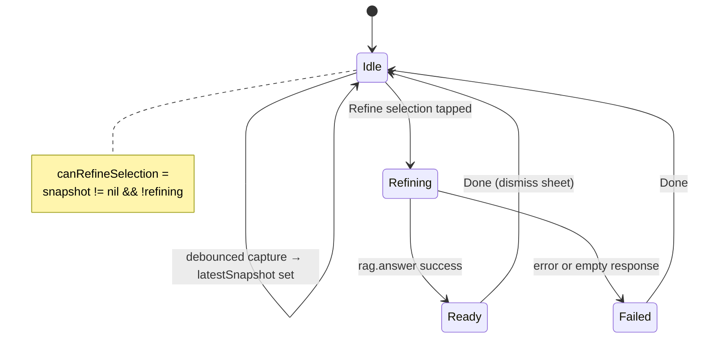

# Inline AI editing (selection refine)

**Version:** 1.2  
**Last updated:** 2026-05-18  
**Implementation:** Partial — `InlineAssistController`, `SelectablePlainTextEditor`, refine sheet in `EditorView`  
**Target UX:** Popover at selection with Apply (v1 design decision)  
**Related:** [EditorAndAIPanel.md](./EditorAndAIPanel.md) · [Components.md § Inline assist](./Components.md#inline-assist) · [**InlineAI-GoogleDocsResearch.md**](./InlineAI-GoogleDocsResearch.md) (Google Docs UX + local-model patterns)

---

## Secondary to writing (principle)

Inline assist is **subordinate to the editor**, not a second authoring surface.

| Rule | Rationale |
|------|-----------|
| **Typing always wins** | No modal that blocks the manuscript; migrate the refine **sheet** → **popover** at selection. |
| **Explicit invoke only** | Refine runs when the user taps Refine (or a preset)—not on every selection change or keystroke. |
| **No auto-apply** | Model output is preview-only until **Apply**; matches Google Gemini “Accept suggestion,” not silent replacement. |
| **No inspector for refine** | Vault chat, citations, and long transcripts stay in the inspector; inline stays spatially tied to the selection. |
| **Minimal GPU wake** | Debounced selection capture, capped selection chars, chat model for refine; **embedding model for index** (and optional light retrieve), never full-document embed per keystroke. |

Competitive UX research (Smart Compose ghost vs Gemini floating bar vs side panel) and memory budgets for small local models: [InlineAI-GoogleDocsResearch.md](./InlineAI-GoogleDocsResearch.md).

---

## Purpose

Let the author **refine the current selection** without opening vault-wide **Chat** in the inspector. Uses the same local LM stack (`RAGService.answer`) with a dedicated refine prompt and `BuiltInAgents.refineProse` — **no vault-wide retrieval** for the query body (selection only).

| Capability | Surface |
|------------|---------|
| Ask about notes / RAG Q&A | Inspector → **Chat** (`ChatPanelView`) |
| Rewrite selection | **Inline** — `EditorView` + `InlineAssistController` |

---

## Implemented anatomy

```
EditorView header
  [Refine selection ✨]  ← disabled until valid selection snapshot
       │
       ▼
SelectablePlainTextEditor (NSTextView)
  onSelectionChange → debounced capture
       │
       ▼
.sheet(showRefineResult)
  refining → ProgressView
  ready    → scrollable result text (selectable)
  failed   → ContentUnavailableView
  [Done]   → dismiss (no Apply merge yet)
```

### Key types

| Type | Role |
|------|------|
| `InlineSelectionSnapshot` | `documentID`, `selectedText`, `selectedRange` |
| `InlineAssistPhase` | `idle` \| `capturing` \| `refining` \| `ready(String)` \| `failed(String)` |
| `InlineAssistController` | Debounced capture, async `refineSelection(using:)` |
| `SelectablePlainTextEditor` | `NSViewRepresentable` bridge; reports `NSRange` without blocking typing |

### Limits (`AISafetyLimits`)

| Constant | Value |
|----------|-------|
| `inlineSelectionDebounceSeconds` | 0.12s |
| `maxInlineSelectionChars` | 1500 (truncated) |
| Sanitization | `AIInput.sanitizeQuery` on selection text |

Refine runs on `assistQueue` (`userInitiated`); UI updates on `@MainActor`.

### Refine rail UX (shipped direction)

- **Left rail** — `OWRefineAssistPanel` + `OWChatStatusStepper` (not a center sheet).
- **Immediate open** — panel appears on Refine click; LM check runs while stepper is visible.
- **Opening beat** — ~220ms per step for *Reading selection* → *Searching vault* so early phases are readable (theatrical vault step even when `refineProse` agent skips wide retrieval).
- **Streaming** — tokens fill the panel before **Review & apply**; **Apply** merges prose + optional `ow` actions.

See [MajorPlan-2026-05.md](../MajorPlan-2026-05.md) §3 (Refine parity doctrine).

---

## Target v1 UX (popover — not fully shipped)

Migrate result UI from **sheet** to **popover** at selection:

1. Preset chips: *Clearer*, *Shorter*, *Expand*, *Fix grammar* (optional v1.1)
2. Optional one-line custom instruction
3. **Preview** diff before **Apply** replaces `selectedRange` in `NSTextView`
4. **Cancel** / Esc dismisses without change

**Author-first:** No auto-apply on model complete — user confirms Apply.

---

## State machine (`InlineAssistPhase`)



| Phase | UI |
|-------|------|
| `idle` | Refine button enabled when `latestSnapshot != nil` |
| `refining` | Button shows `ProgressView`; sheet open with “Refining selection…” |
| `ready(text)` | Sheet shows selectable result text |
| `failed(message)` | Sheet shows error `ContentUnavailableView` |

---

## AI contract (implemented)

- **Query:** Wrapped selection in `refineQuery(for:)` — instructs model to return only improved prose.
- **Agent:** `BuiltInAgents.refineProse`
- **API:** `rag.answer(query:agent:)` (non-streaming), not vault `buildContext` for the user message body.

---

## Why not inspector or bubble

See [EditorAndAIPanel.md](./EditorAndAIPanel.md). Refine is spatially tied to the editor; vault chat needs citations and a stable transcript column.

---

## Implementation checklist

- [x] Selection tracking (`SelectablePlainTextEditor`)
- [x] Debounced `InlineSelectionSnapshot`
- [x] Toolbar **Refine selection** + async refine
- [x] Result sheet (read-only)
- [ ] Popover anchored to selection (replace sheet)
- [ ] **Apply** replaces range in text view + `pastWrites.recordEdit`
- [ ] Preset chips + custom instruction field
- [ ] Context menu entry
- [ ] VoiceOver: “Refine selection, button” · “Replace selected text, button”

---

*See also: [InlineAI-GoogleDocsResearch.md](./InlineAI-GoogleDocsResearch.md) · [AIActivityStates.md](./AIActivityStates.md) (vault chat only)*
