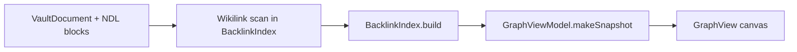

# Graph view (backlinks & visualization)

**Epic:** [E-06](../RoadmapEpics.md#e-06-backlinks-graph)  
**Feature doc (legacy index name):** backlinks-graph (planned kebab file)  
**Architecture:** [Overview.md § Workbench](../Architecture/Overview.md#workbench-information-architecture)  
**Status:** **Partial** — shell + circle-layout MVP shipped; force-directed layout and inspector backlinks remain E-06

---

## Summary

OpenWrite provides a **read-only graph** of documents and wikilink edges derived from NDL `[[wikilink]]` blocks—not a full Anytype object-relation graph or Logseq block-level query engine in v1. The graph answers: *what connects to what in my vault?* and complements semantic related-notes (E-03) with explicit structural links.

**Design principle:** Native graph without plugin soup (Obsidian) and without AGPL graph-parser code (Logseq). Clean-room Swift layout inspired by public UX patterns only.

---

## Shell UX (Anytype-inspired, local-only)

Aligned with [AnytypeUIInspiration.md](../design/AnytypeUIInspiration.md) § Graph tab and global graph route.

| Region | Behavior |
|--------|----------|
| **Left sidebar → Graph row** | Under **Objects**, opens vault graph in the center card (`workbench.showGraph()`). |
| **Center card tab bar** | **Editor \| Graph** capsule tabs above the elevated `OWRoundedRect` panel — same mental model as Anytype `main/graph` header tabs. |
| **Graph canvas** | Full bleed inside the center card; `DesignTokens.Color.editorCanvas` background. |
| **Floating status bar** | Bottom overlay: note count, isolated-note hint, zoom − / Reset / + (Anytype timeline bar simplified — no time scrubber in v1). |
| **Node tap** | Selects `VaultDocument`, switches to **Editor** tab. |
| **Empty vault** | `OWPageHero` — “No notes in vault”. |
| **No resolved links** | `OWPageHero` — “No links yet” + `[[wikilinks]]` hint. |

```text
┌──────────────┬────────────────────────────────────────────┐
│ OpenWrite    │  [ Editor ]  [ Graph ]                     │
│ Search…      │  ┌──────────────────────────────────────┐  │
│ Objects      │  │  ○───○     circle-layout graph       │  │
│  · Graph ◀── │  │    \   /   pan + zoom                │  │
│ Vault list   │  │     ○                              │  │
│              │  │  ── N notes · zoom controls ──      │  │
│ ⚙            │  └──────────────────────────────────────┘  │
└──────────────┴────────────────────────────────────────────┘
```

**Implementation:** `UI/Shell/AnytypeShellView.swift` (chrome), `UI/Graph/GraphView.swift` (canvas), `UI/Shell/CenterWorkbenchTab.swift` (tab enum), `Core/Graph/BacklinkIndex.swift` + `GraphViewModel.swift` (data).

---

## Scope

### In scope (v1 — E-06)

| Capability | Detail |
|------------|--------|
| Backlink index | Map resolved `[[title]]` → adjacency (`BacklinkIndex.build`) |
| Graph canvas | Read-only **circle layout** MVP; pan/zoom |
| Click navigation | Select node → open document in editor |
| Rebuild | Rebuilt when `VaultStore.documents` changes (`ContentView`) |

### Out of scope (v1)

| Capability | Rationale | Epic / ADR |
|------------|-----------|------------|
| Block-level graph | Complexity; NDL block refs deferred | planned v2 |
| Typed relation edges | Anytype parity non-goal | [ADR-0002](../adr/0002-typed-pages-object-model.md) |
| Graph query language | Logseq Datalog-style queries | **wont** v1 |
| Force-directed 60fps layout | Phase 2 after MVP circle layout | E-06 |
| 3D / VR graph | — | **wont** |
| Collaborative live cursors on graph | Local-only | [ADR-0001](../adr/0001-local-only-architecture.md) |

---

## Data flow



**Indexing trigger:** `ContentView` calls `BacklinkIndex.build(from:)` on appear and whenever `vaultStore.documents` changes. Target E-06: incremental `update(document:)` on save.

---

## UI placement

| Surface | Role |
|---------|------|
| Center **Graph** tab | Full-vault graph (`GraphView`) |
| Sidebar **Graph** row | Same as Graph tab |
| Inspector **Backlinks** tab | Incoming links for active note (E-08 — planned) |
| Editor inline | Wikilink autocomplete (E-02; partial) |

Files: `UI/Graph/GraphView.swift`, `Core/Graph/GraphViewModel.swift`, `Core/Graph/BacklinkIndex.swift`.

---

## Node & edge model

```swift
struct GraphSnapshot {
    struct Node: Identifiable {
        let id: UUID
        let title: String
        let pageType: PageType
        let position: CGPoint
        let isSelected: Bool
    }
    struct Edge: Identifiable {
        let id: String
        let sourceID: UUID
        let targetID: UUID
    }
}
```

Unresolved wikilinks do not create ghost nodes in the MVP; they are ignored until a document title matches (case-insensitive). Phase 2: dashed ghost nodes per [VaultAndFileTree.md](./VaultAndFileTree.md).

---

## Layout & performance

| Vault size | Strategy (current / planned) |
|------------|------------------------------|
| Any | **Circle layout** on main actor (MVP) |
| &lt; 500 docs | Target: force-directed in-memory; 60fps pan/zoom |
| 500–5000 | Sample or “focus neighborhood” mode |
| &gt; 5000 | Filter by type/tag/date |

SwiftUI `Canvas` for edges/nodes; no WebView graph.

---

## Acceptance criteria (E-06)

- [x] Graph shell: Editor \| Graph tabs + sidebar Graph entry
- [x] Circle-layout canvas from vault titles + resolved wikilinks
- [x] Clicking node opens correct document in editor
- [ ] Saving `[[Other]]` updates index within one edit cycle (incremental API)
- [ ] Inspector lists incoming backlinks with snippet context
- [ ] Rebuild stress test on 100+ doc sample vault

---

## Competitor mapping

| Source | Borrow | Do not ship |
|--------|--------|-------------|
| Obsidian | Global graph, local graph, link colors | Plugin API, CodeMirror |
| Logseq | Block refs, graph parser ideas | `graph-parser` AGPL code |
| Anytype | Graph route, header tabs, floating bottom chrome | Object graph schema, ASAL code |
| Reor | Semantic + wiki (sidebar) | Electron graph widget |

---

## Pass 1 absorption

| Absorbed | Missing |
|----------|---------|
| `BacklinkIndex.build(from:)` + outlinks | Incremental per-save update |
| `GraphView.swift` + `GraphViewModel` | Force layout, ghost nodes |
| `AnytypeShellView` Editor \| Graph tabs | Inspector backlinks tab |
| `SidebarSection.graph` + sidebar row | Block-ref edges, graph persistence |

---

## Related

- [FeatureParityMatrix.md § Graph](../FeatureParityMatrix.md#3-graph--linking)
- [Workbench.md](./Workbench.md) — graph as center tab
- [AnytypeUIInspiration.md](../design/AnytypeUIInspiration.md) — graph shell patterns
- [NDL/Specification.md](../NDL/Specification.md) — `wikilink` block kind
