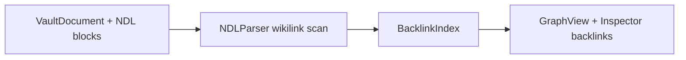

# Graph view (backlinks & visualization)

**Epic:** [E-06](../RoadmapEpics.md#e-06-backlinks-graph)  
**Feature doc (legacy index name):** backlinks-graph (planned kebab file)  
**Architecture:** [Overview.md § Workbench](../Architecture/Overview.md#workbench-information-architecture)  
**Status:** **Partial** (Phase 1 pass: `BacklinkIndex` stub; no `GraphView.swift` UI yet)

---

## Summary

OpenWrite provides a **read-only graph** of documents and wikilink edges derived from NDL `[[wikilink]]` blocks—not a full Anytype object-relation graph or Logseq block-level query engine in v1. The graph answers: *what connects to what in my vault?* and complements semantic related-notes (E-03) with explicit structural links.

**Design principle:** Native graph without plugin soup (Obsidian) and without AGPL graph-parser code (Logseq). Clean-room Swift layout inspired by public UX patterns only.

---

## Scope

### In scope (v1 — E-06)

| Capability | Detail |
|------------|--------|
| Backlink index | Map `targetTitle` → `[sourceDocID]` from parsed wikilinks |
| Incoming links panel | Inspector / sidebar list for selected note |
| Graph canvas | Read-only force-directed or hierarchical layout; pan/zoom |
| Click navigation | Select node → open document in editor |
| Rebuild | Full rebuild from vault documents on demand + after save |

### Out of scope (v1)

| Capability | Rationale | Epic / ADR |
|------------|-----------|------------|
| Block-level graph | Complexity; NDL block refs deferred | planned v2 |
| Typed relation edges | Anytype parity non-goal | [ADR-0002](../adr/0002-typed-pages-object-model.md) |
| Graph query language | Logseq Datalog-style queries | **wont** v1 |
| 3D / VR graph | — | **wont** |
| Collaborative live cursors on graph | Local-only | [ADR-0001](../adr/0001-local-only-architecture.md) |

---

## Data flow



**Indexing trigger:** On document save, `VaultStore` notifies `BacklinkIndex.update(document:)` (target API in E-06). Optional: E-04 indexer maintains a persisted edge table under `index/graph.sqlite` for large vaults.

---

## UI placement

| Surface | Role |
|---------|------|
| Sidebar **Graph** section | Full-screen graph (`SidebarSection.graph`) |
| Inspector **Backlinks** tab | Incoming links for active note (E-08 integration) |
| Editor inline | Wikilink autocomplete (E-02; partial in pass 1) |

Planned file: `UI/Graph/GraphView.swift` + `Core/Graph/GraphViewModel.swift` (layout positions, node metadata).

---

## Node & edge model

```swift
struct GraphNode: Identifiable {
    let id: UUID           // VaultDocument.id
    let title: String
    let pageType: PageType // optional styling
}

struct GraphEdge: Identifiable {
    let id: String         // "\(sourceUUID)->\(targetTitle)"
    let sourceID: UUID
    let targetID: UUID?    // nil if unresolved wikilink
    let targetTitle: String
}
```

Unresolved wikilinks render as **dashed ghost nodes** (title only) until a matching document exists—similar mental model to Obsidian unresolved links.

---

## Layout & performance

| Vault size | Strategy |
|------------|----------|
| &lt; 500 docs | In-memory layout on main actor; 60fps pan/zoom target |
| 500–5000 | Sample or cluster peripheral nodes; “focus neighborhood” mode |
| &gt; 5000 | Filter by type/tag/date; defer full render |

No WebView graph (contrast Logseq/AFFiNE canvas stacks)—`Canvas` or `SpriteKit`/`Metal` only if profiling demands.

---

## Acceptance criteria (E-06)

- [ ] Saving a note with `[[Other]]` updates backlink index within one edit cycle
- [ ] Graph shows all documents with ≥1 link; isolated notes optional toggle
- [ ] Clicking node opens correct `VaultDocument` in editor
- [ ] Inspector lists incoming backlinks with snippet context
- [ ] Rebuild from vault completes without crash on sample vault (100+ docs)

---

## Competitor mapping

| Source | Borrow | Do not ship |
|--------|--------|-------------|
| Obsidian | Global graph, local graph, link colors | Plugin API, CodeMirror |
| Logseq | Block refs, graph parser ideas | `graph-parser` AGPL code |
| Anytype | Relation types on graph | Object graph schema, ASAL code |
| Reor | Semantic + wiki (sidebar) | Electron graph widget |

---

## Pass 1 absorption

| Absorbed | Missing |
|----------|---------|
| `Core/Graph/BacklinkIndex.swift` protocol/stub | Incremental update implementation |
| `SidebarSection.graph` enum | `GraphView.swift` |
| Wikilink in `NDLParser` (partial) | Block-ref edges, graph persistence |
| Roadmap + architecture docs | Layout engine, inspector backlinks tab |

---

## Related

- [FeatureParityMatrix.md § Graph](../FeatureParityMatrix.md#3-graph--linking)
- [Workbench.md](./Workbench.md) — graph as sidebar section
- [NDL/Specification.md](../NDL/Specification.md) — `wikilink` block kind
