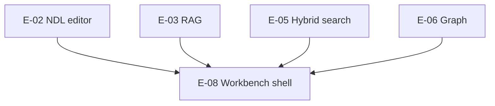

# Workbench shell

**Epic:** [E-08](../RoadmapEpics.md#e-08-affine-style-workbench-shell)  
**Design reference:** [design/Components.md](../design/Components.md) (planned), [design/README.md](../design/README.md)  
**Inspiration:** AFFiNE workbench (MIT patterns only — no BlockSuite)  
**Status:** **Partial** (Phase 1 pass: split view, inspector tabs, sidebar enum; full tab model planned)

---

## Summary

The **workbench** is OpenWrite’s primary application chrome: sidebar navigation, document list, central NDL editor, and trailing **inspector** for AI, properties, and writing context. It replaces a single `ContentView` list+editor with an AFFiNE-inspired **View Islands** layout implemented in native SwiftUI (`NavigationSplitView`).

Goal: calmer daily writing than Anytype’s space onboarding, clearer hierarchy than Reor’s minimal list UI, and no Electron tab soup.

---

## Layout regions

```
┌──────────────┬────────────────────────────┬──────────────────┐
│   Sidebar    │   Document list / Editor   │    Inspector     │
│  (sections)  │   (hero surface)           │  (tabbed rail)   │
└──────────────┴────────────────────────────┴──────────────────┘
```

| Region | Responsibility | Phase 1 pass |
|--------|----------------|--------------|
| **Sidebar** | `SidebarSection`: All notes, Inbox, Journal, Types, Graph, Search entry | Enum + partial wiring |
| **List** | Filtered documents by section; selection drives editor | `ContentView` list |
| **Editor** | `EditorView` — NDL block editing (E-02) | Basic text/block UI |
| **Inspector** | `WorkbenchInspectorView` — segmented tabs | Chat, Related, Past Writes |

---

## State management

`WorkbenchState` (`@MainActor`, `ObservableObject`) owns:

| Property | Purpose |
|----------|---------|
| `selectedSection` | Active sidebar filter |
| `inspectorTab` | `InspectorTab` — chat, related, pastWrites |
| `isInspectorVisible` | Toggle trailing rail (keyboard shortcut target) |
| `searchQuery` | Hooks E-05 hybrid search bar |

**Future (E-08):** Tab strip for multiple open documents (AFFiNE-style), `NavigationPath` per tab, pinned notes collection.

---

## Inspector tabs

| Tab | Epic | Implementation |
|-----|------|----------------|
| **Chat** | E-03 | `ChatPanelView` — Q&A with citations (stub RAG) |
| **Related** | E-03 | `RelatedNotesView` — semantic neighbors |
| **Past Writes** | — (product) | `PastWritesTimelineView` — session timeline |
| **Properties** | E-02 / ADR-0002 | `PropertyInspectorView` — typed page fields |
| **Backlinks** | E-06 | Planned — incoming wikilinks |

`WorkbenchInspectorView` switches on `workbench.inspectorTab`; extend `InspectorTab` enum when adding panels.

---

## Sidebar sections

```swift
enum SidebarSection: String, CaseIterable, Identifiable {
    case allNotes
    case inbox      // fast capture target (E-09)
    case journal
    case types
    case graph      // E-06
    case search     // E-05 entry
}
```

**Smart collections (v1.1):** Saved predicates over `PageType` + `PageProperties` (AFFiNE collection rules, clean-room `CollectionRuleEngine`).

---

## Keyboard & accessibility

| Shortcut (target) | Action |
|-------------------|--------|
| ⌘\ | Toggle inspector |
| ⌘K | Quick open / hybrid search |
| ⌘⇧N | Fast capture (E-09) |
| ⌘1–5 | Focus sidebar sections |

See [design/Accessibility.md](../design/Accessibility.md) for VoiceOver labels on sidebar + inspector.

---

## Dependency graph



Workbench **integrates** panels; it does not own indexer or crypto logic.

---

## Acceptance criteria (E-08)

- [ ] Three-column layout resizable; state persists across launches
- [ ] Sidebar switches document list filters without losing selection when possible
- [ ] Inspector tabs bind to live services (`OpenWriteAIServices`, `PastWritesService`)
- [ ] Search entry opens hybrid search UI (E-05)
- [ ] Graph section navigates to graph surface (E-06)

---

## Pass 1 absorption

| Absorbed | Missing |
|----------|---------|
| `WorkbenchState`, `SidebarSection`, `InspectorTab` | Multi-document tabs |
| `WorkbenchInspectorView` + AI/Past Writes panels | Dedicated `WorkbenchRootView` replacing monolithic `ContentView` |
| `DesignTokens.swift` | View Islands per-route headers |
| Property UI (`TypePickerView`, `PropertyInspectorView`) | Pinned docs, collections |

---

## Related

- [FeatureParityMatrix.md § Workbench](../FeatureParityMatrix.md#14-workbench--navigation)
- [GraphView.md](./GraphView.md)
- [OpenWriteMasterPlan.md § AFFiNE mapping](../OpenWriteMasterPlan.md)
